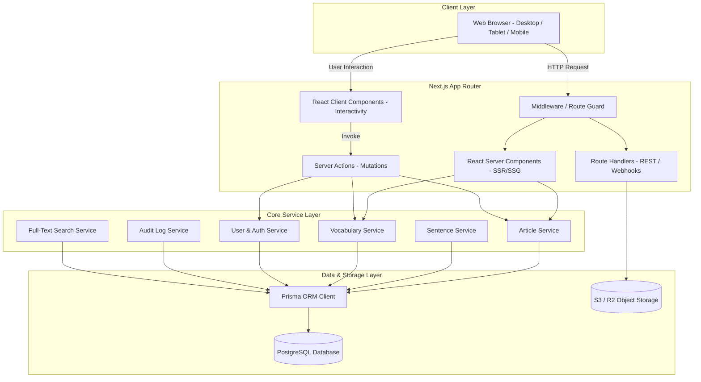

# ReadToImprove: Architecture Specification

## 1. Architectural Style: Modular Monolith
ReadToImprove is architected as a cohesive **Modular Monolith** using the Next.js App Router. This avoids premature microservice overhead while enforcing strict separation of concerns between presentation, service orchestration, and data persistence.



---

## 2. Directory Structure Conventions

The project will follow a feature-driven, clean architecture structure under `src/`:

```text
d:\readtoimprove/
├── .env.example
├── .env.local (git-ignored)
├── README.md
├── package.json
├── tsconfig.json
├── tailwind.config.ts
├── prisma/
│   ├── schema.prisma
│   ├── seed.ts
│   └── migrations/
├── docs/
│   ├── 00_DISCOVERY_AND_REQUIREMENTS.md
│   ├── 01_ARCHITECTURE_SPECIFICATION.md
│   ├── 02_DATABASE_SCHEMA_DESIGN.md
│   ├── 03_ADMIN_SECURITY_SPECIFICATION.md
│   ├── 04_CONTENT_MODEL_AND_READING_EXPERIENCE.md
│   └── 05_RISKS_AMBIGUITIES_AND_DECISIONS.md
├── src/
│   ├── app/
│   │   ├── (public)/                 # Public reader grouping
│   │   │   ├── page.tsx              # Homepage
│   │   │   ├── articles/
│   │   │   │   └── [slug]/
│   │   │   │       └── page.tsx      # Article bilingual reader
│   │   │   ├── search/
│   │   │   │   └── page.tsx      # Search & filter page
│   │   │   └── user/
│   │   │       ├── word-bank/        # Saved vocabulary
│   │   │       └── history/          # Reading history
│   │   ├── (auth)/                   # Authentication routes
│   │   │   ├── login/
│   │   │   └── register/
│   │   ├── secure-console-x7/        # Stealth Admin Console (configurable route)
│   │   │   ├── layout.tsx            # Admin layout with requireAdmin() check
│   │   │   ├── page.tsx              # Dashboard metrics
│   │   │   ├── articles/             # Article CRUD
│   │   │   ├── categories/           # Category CRUD
│   │   │   ├── vocabulary/           # Global Vocab CRUD
│   │   │   ├── users/                # User management
│   │   │   ├── media/                # Asset library
│   │   │   └── audit-logs/           # Audit trail
│   │   ├── api/                      # Route Handlers
│   │   │   ├── auth/                 # NextAuth handlers
│   │   │   ├── upload/               # Media upload handler
│   │   │   └── search/               # Search autocomplete
│   │   ├── robots.ts                 # Dynamic robots.txt (blocks stealth admin)
│   │   ├── sitemap.ts                # Dynamic sitemap (omits stealth admin)
│   │   └── layout.tsx                # Root layout
│   ├── components/
│   │   ├── ui/                       # shadcn/ui primitive components
│   │   ├── reader/                   # Bilingual reader components
│   │   │   ├── sentence-pair.tsx     # English + Vietnamese sentence row
│   │   │   ├── vocab-highlight.tsx   # Inline highlight trigger
│   │   │   ├── vocab-tooltip.tsx     # Popover dictionary card
│   │   │   ├── word-bank-sheet.tsx   # Side drawer for all article vocabulary
│   │   │   └── reader-toolbar.tsx    # Font size, show/hide translation toggle
│   │   ├── admin/                    # Admin CMS specific UI components
│   │   ├── common/                   # Navbar, footer, theme provider, breadcrumbs
│   │   └── home/                     # Hero, article cards, category chips
│   ├── lib/
│   │   ├── prisma.ts                 # Singleton Prisma client
│   │   ├── auth.ts                   # Auth options and session helper
│   │   ├── security.ts               # requireAdmin(), rate-limiting, sanitization
│   │   ├── cefr.ts                   # CEFR level badge styling and ordering
│   │   └── utils.ts                  # General helpers
│   ├── services/                     # Business logic & data queries
│   │   ├── article.service.ts
│   │   ├── sentence.service.ts
│   │   ├── vocabulary.service.ts
│   │   ├── user.service.ts
│   │   ├── search.service.ts
│   │   └── audit.service.ts
│   ├── types/                        # Global TypeScript declarations
│   └── validations/                  # Zod schemas for forms and actions
```

---

## 3. Server Components vs Client Components Boundaries

To guarantee high performance (Lighthouse Performance $\ge 90$ and FCP $< 1.5$s), we maximize React Server Components:

| Component / Page | Component Type | Reason |
| :--- | :--- | :--- |
| **Homepage Article Feed** | Server Component | Fetches articles directly from Prisma; zero client JS bundle required for layout. |
| **Article Reader Shell** | Server Component | Pre-renders complete English and Vietnamese text for instant paint and SEO indexing. |
| **Bilingual Interactive Row** | Client Component | Manages local UI state: tooltip open/close, hover states, and translation visibility toggle. |
| **Word Bank Drawer** | Client Component | Handles user interactions: playing pronunciation audio, saving word to personal bank. |
| **Search & Filter Bar** | Client Component | Manages debounced input query and URL search params manipulation. |
| **Admin Forms & Editors** | Client Component | Handles complex form state, drag-and-drop sentence reordering, and Zod client validation. |
| **Admin Layout / Guard** | Server Component | Server-side `requireAdmin()` check executed before streaming any admin markup. |

---

## 4. State Management Strategy

1. **Server State**: Managed via Next.js Server Components and Server Actions with `revalidatePath` and `revalidateTag` for automatic cache invalidation.
2. **URL State**: Filter params (category, CEFR level, search query, page number) stored directly in URL search parameters (`?category=tech&cefr=B2&q=ai`) for shareability and server-side rendering.
3. **Local UI State**: React `useState` and `useReducer` for interactive tooltips, font-size adjustment, and translation toggle mode.
4. **User Session State**: Session cookie decoded on server; lightweight client session provided via React Context.
