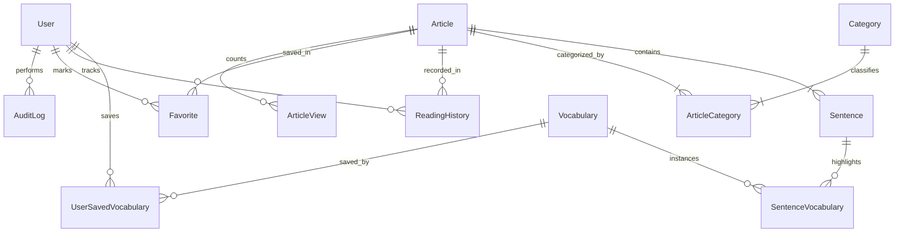

# ReadToImprove: Database Schema & Entity Specification

## 1. Relational Model Overview
The database layer is powered by **PostgreSQL 16** via **Prisma ORM**. The data model is strictly relational with foreign key constraints, cascade rules, indexing strategies, and full-text search capability.



---

## 2. Complete Entity Specifications

### 2.1 User & Identity
```prisma
enum Role {
  USER
  ADMIN
}

model User {
  id               String                 @id @default(cuid())
  email            String                 @unique
  passwordHash     String
  name             String
  role             Role                   @default(USER)
  avatarUrl        String?
  isActive         Boolean                @default(true)
  emailVerified    DateTime?
  savedVocabulary  UserSavedVocabulary[]
  readingHistory   ReadingHistory[]
  favorites        Favorite[]
  auditLogs        AuditLog[]
  createdAt        DateTime               @default(now())
  updatedAt        DateTime               @updatedAt

  @@index([email])
  @@index([role])
}
```

### 2.2 Articles & Taxonomy
```prisma
enum ArticleStatus {
  DRAFT
  PENDING_REVIEW
  PUBLISHED
  ARCHIVED
}

enum CefrLevel {
  A1
  A2
  B1
  B2
  C1
  C2
}

model Article {
  id                  String            @id @default(cuid())
  slug                String            @unique
  titleEn             String
  titleVi             String
  excerptEn           String?
  excerptVi           String?
  sourceName          String
  sourceUrl           String
  originalPublishedAt DateTime?
  thumbnailUrl        String?
  videoUrl            String?
  cefrLevel           CefrLevel         @default(B2)
  status              ArticleStatus     @default(DRAFT)
  publishedAt         DateTime?
  scheduledAt         DateTime?
  viewsCount          Int               @default(0)
  readingTimeMinutes  Int               @default(3)

  // SEO Fields
  metaTitle           String?
  metaDescription     String?
  canonicalUrl        String?
  ogImage             String?

  // Relations
  categories          ArticleCategory[]
  sentences           Sentence[]
  readingHistories    ReadingHistory[]
  favorites           Favorite[]
  articleViews        ArticleView[]

  createdAt           DateTime          @default(now())
  updatedAt           DateTime          @updatedAt

  @@index([status, publishedAt])
  @@index([cefrLevel])
  @@index([slug])
}

model Category {
  id          String            @id @default(cuid())
  slug        String            @unique
  nameEn      String
  nameVi      String
  description String?
  orderIndex  Int               @default(0)
  articles    ArticleCategory[]
  createdAt   DateTime          @default(now())
  updatedAt   DateTime          @updatedAt

  @@index([slug])
}

model ArticleCategory {
  articleId  String
  categoryId String
  assignedAt DateTime @default(now())

  article    Article  @relation(fields: [articleId], references: [id], onDelete: Cascade)
  category   Category @relation(fields: [categoryId], references: [id], onDelete: Cascade)

  @@id([articleId, categoryId])
  @@index([categoryId])
}
```

### 2.3 Sentences & Vocabulary Mapping
```prisma
model Sentence {
  id          String               @id @default(cuid())
  articleId   String
  orderIndex  Int
  textEn      String
  textVi      String

  article     Article              @relation(fields: [articleId], references: [id], onDelete: Cascade)
  vocabularies SentenceVocabulary[]

  createdAt   DateTime             @default(now())
  updatedAt   DateTime             @updatedAt

  @@unique([articleId, orderIndex])
  @@index([articleId])
}

model Vocabulary {
  id              String                 @id @default(cuid())
  word            String                 // e.g. "sustainable"
  normalizedLemma String                 // lowercased root e.g. "sustain"
  ipa             String?                // e.g. "/səˈsteɪnəbl/"
  pos             String?                // part of speech e.g. "adjective"
  meaningVi       String                 // Vietnamese translation
  exampleEn       String?                // Example in English
  exampleVi       String?                // Example translation
  cefrLevel       CefrLevel              @default(B2)
  audioUrl        String?

  sentenceInstances SentenceVocabulary[]
  userSaves         UserSavedVocabulary[]

  createdAt       DateTime               @default(now())
  updatedAt       DateTime               @updatedAt

  @@index([word])
  @@index([normalizedLemma])
  @@index([cefrLevel])
}

model SentenceVocabulary {
  id              String     @id @default(cuid())
  sentenceId      String
  vocabularyId    String
  startOffset     Int        // Character index in textEn
  endOffset       Int        // Character index end in textEn
  highlightedText String     // Exact slice from textEn (e.g. "sustainable development")

  sentence        Sentence   @relation(fields: [sentenceId], references: [id], onDelete: Cascade)
  vocabulary      Vocabulary @relation(fields: [vocabularyId], references: [id], onDelete: Cascade)

  createdAt       DateTime   @default(now())

  @@index([sentenceId])
  @@index([vocabularyId])
}
```

### 2.4 User Progression & Bookmarks
```prisma
model UserSavedVocabulary {
  id           String     @id @default(cuid())
  userId       String
  vocabularyId String
  notes        String?
  isMastered   Boolean    @default(false)
  savedAt      DateTime   @default(now())

  user         User       @relation(fields: [userId], references: [id], onDelete: Cascade)
  vocabulary   Vocabulary @relation(fields: [vocabularyId], references: [id], onDelete: Cascade)

  @@unique([userId, vocabularyId])
  @@index([userId])
}

model ReadingHistory {
  id             String    @id @default(cuid())
  userId         String
  articleId      String
  readPercentage Int       @default(0) // 0 - 100
  completed      Boolean   @default(false)
  lastReadAt     DateTime  @default(now())

  user           User      @relation(fields: [userId], references: [id], onDelete: Cascade)
  article        Article   @relation(fields: [articleId], references: [id], onDelete: Cascade)

  @@unique([userId, articleId])
  @@index([userId])
}

model Favorite {
  id        String   @id @default(cuid())
  userId    String
  articleId String
  createdAt DateTime @default(now())

  user      User     @relation(fields: [userId], references: [id], onDelete: Cascade)
  article   Article  @relation(fields: [articleId], references: [id], onDelete: Cascade)

  @@unique([userId, articleId])
  @@index([userId])
}
```

### 2.5 Operational & Audit Logs
```prisma
model AuditLog {
  id        String   @id @default(cuid())
  userId    String?
  action    String   // e.g. "ARTICLE_CREATE", "ARTICLE_PUBLISH", "USER_ROLE_CHANGE"
  entity    String   // e.g. "Article", "User", "Vocabulary"
  entityId  String?
  details   String?  // JSON stringified payload
  ipAddress String?
  userAgent String?
  createdAt DateTime @default(now())

  user      User?    @relation(fields: [userId], references: [id], onDelete: SetNull)

  @@index([entity, entityId])
  @@index([createdAt])
}

model ArticleView {
  id        String   @id @default(cuid())
  articleId String
  ipAddress String?
  userAgent String?
  viewedAt  DateTime @default(now())

  article   Article  @relation(fields: [articleId], references: [id], onDelete: Cascade)

  @@index([articleId, viewedAt])
}

model SystemSetting {
  id          String   @id @default(cuid())
  key         String   @unique
  value       String
  description String?
  updatedAt   DateTime @updatedAt
}
```

---

## 3. Database Indexes & Performance Strategy
1. **Article Status & Publishing**: Composite index on `[status, publishedAt]` for fast queries retrieving published articles ordered by publication date.
2. **Search Optimization**: Initial text queries use PostgreSQL `ILIKE` and B-tree indexes; in Phase 8, we add PostgreSQL full-text search vectors (`tsvector` on `titleEn`, `titleVi`, `excerptEn`) or `pg_trgm` GIN indexes for fast fuzzy search.
3. **Offset-based Sentence Vocabulary**: Foreign keys indexed on both `sentenceId` and `vocabularyId` to enable single-pass joins when loading an article.
