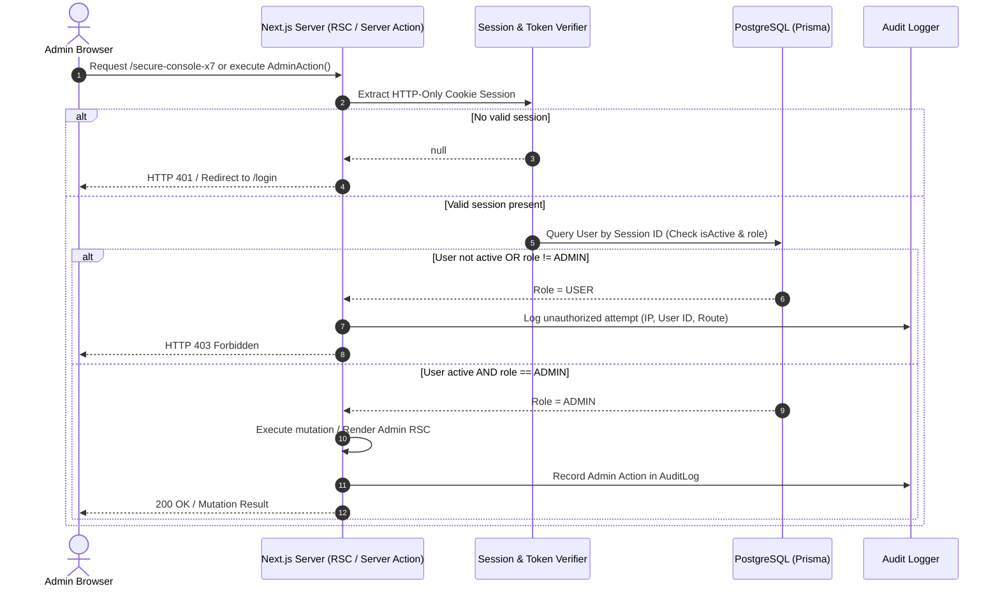

# ReadToImprove: Admin & System Security Specification

## 1. Threat Model & Philosophy
In ReadToImprove, the administrative interface controls published content, user accounts, and system operations. Security must be uncompromising:
1. **Zero Public Footprint**: The administrative console URL is completely hidden from public discoverability.
2. **Defense in Depth**: A hidden URL is merely a layer of obscurity, not security. Real security is strictly enforced through server-side authentication, role authorization, and audit logging.
3. **Fail Closed**: Any unauthenticated request to an administrative endpoint immediately fails with `401 Unauthorized`. Any authenticated non-admin user request immediately fails with `403 Forbidden` and logs a security event.

---

## 2. Stealth Route Architecture

### 2.1 Route Obscuration
- **Path Selection**: Configured via an environment variable `ADMIN_ROUTE_PATH` with a default of `/secure-console-x7`.
- **Search Engine Blocking**:
  - `robots.ts` explicitly disallows crawler access:
    ```typescript
    // src/app/robots.ts
    export default function robots(): MetadataRoute.Robots {
      return {
        rules: [
          {
            userAgent: '*',
            allow: '/',
            disallow: ['/secure-console-x7/*', '/api/admin/*'],
          },
        ],
        sitemap: 'https://readtoimprove.com/sitemap.xml',
      };
    }
    ```
  - Admin layout embeds strict `<meta name="robots" content="noindex, nofollow, noarchive" />`.
  - `sitemap.ts` strictly enumerates only public published articles, categories, and landing pages.
- **Zero DOM Leakage**: No navigation bar, footer, link tags, or client-side bundles ever mention or reference the administrative route.

### 2.2 Server-Side Authorization Pipeline



---

## 3. The `requireAdmin()` Server Guard

All Admin Server Components, Server Actions, and Route Handlers must invoke the centralized authorization guard:

```typescript
// src/lib/security.ts
import { auth } from '@/lib/auth';
import { prisma } from '@/lib/prisma';
import { redirect } from 'next/navigation';

export async function requireAdmin() {
  const session = await auth();

  if (!session || !session.user || !session.user.id) {
    redirect('/login?returnUrl=/secure-console-x7');
  }

  const user = await prisma.user.findUnique({
    where: { id: session.user.id },
    select: { id: true, email: true, role: true, isActive: true },
  });

  if (!user || !user.isActive || user.role !== 'ADMIN') {
    // Log security warning
    console.warn(`[SECURITY ALERT] Unauthorized admin access attempt by: ${session.user.id}`);
    throw new Error('403 Forbidden: Administrator privileges required.');
  }

  return user;
}
```

---

## 4. Admin Account Bootstrapping & Credential Lifecycle

### 4.1 Initial Admin Provisioning
The initial administrator account is generated deterministically during database seeding (`prisma/seed.ts`) using protected environment variables:
```env
ADMIN_EMAIL="admin@readtoimprove.com"
ADMIN_INITIAL_PASSWORD="GenerateStrongInitialPassword2026!"
```
- **Hashing**: Initial password is salt-hashed using `bcrypt` (12 rounds).
- **Security Check**: The seed script checks if an `ADMIN` user already exists. If present, it skips recreation to prevent overwriting modified passwords.
- **Git Hygiene**: Neither `.env` nor `.env.local` are ever committed. Only `.env.example` with dummy values is kept in version control.

### 4.2 Password Rotation & Updates
The admin console includes an Account Security panel allowing the administrator to update their email and change their password (verifying current password before hashing the replacement).

---

## 5. Defense Against Common Vulnerabilities

| Threat | Mitigation Mechanism |
| :--- | :--- |
| **Brute Force / Credential Stuffing** | In-memory or Redis-backed sliding window rate limiter on `/api/auth/*` (max 5 failed attempts per 15 minutes per IP). |
| **SQL Injection** | Exclusively use Prisma ORM parameterized queries; raw SQL is prohibited unless using `$queryRaw` with tagged template literals. |
| **Cross-Site Scripting (XSS)** | React automatic JSX encoding, strict Content Security Policy (CSP) headers, and DOMPurify for any HTML snippet rendering. |
| **Cross-Site Request Forgery (CSRF)** | Next.js Server Actions enforce built-in origin and host header validation; cookies use `SameSite=Lax` or `Strict` with `Secure` flag. |
| **Session Hijacking** | Sessions stored in `HttpOnly`, `Secure`, `SameSite=Lax` cookies; invalidation on password change. |
| **Malicious File Uploads** | Strict MIME-type checking (JPEG, PNG, WebP only), magic number byte verification, maximum size limit (5MB), and stored in isolated object storage with sanitized UUID filenames. |
