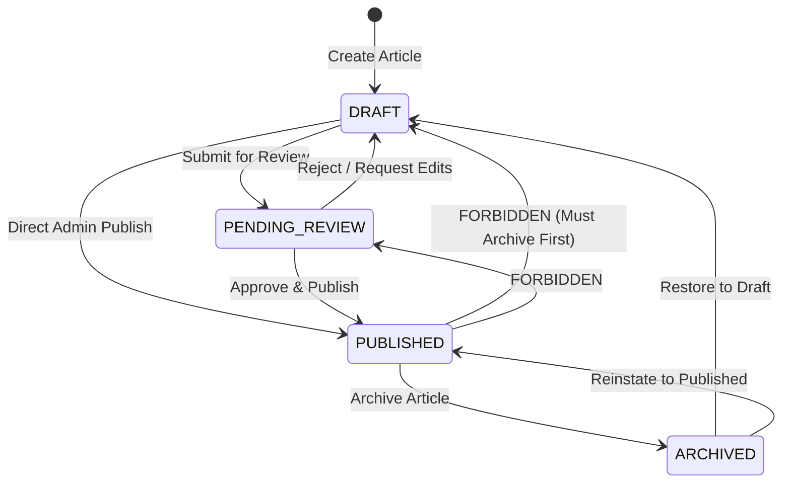

# PHASE 04 — IMPLEMENTATION PLAN (REVISED)

```text
PHASE: 04
STATUS: PLAN
CURRENT DECISION: AWAITING_APPROVAL
```

## 1. Phase Objective
Build the comprehensive, production-ready Private Admin Content Management System (CMS) console (`/secure-console-x7`) for **ReadToImprove**. Empower the administrator with complete administrative control over:
- **Articles**: Full state-machine lifecycle management (`DRAFT`, `PENDING_REVIEW`, `PUBLISHED`, `ARCHIVED`), scheduled publishing rules, bilingual metadata, CEFR rating, reading time estimation, category associations, and SEO metadata.
- **Bilingual Sentences**: Exact sentence alignment, order indexing, inline editing, addition, deletion, and transaction-safe reordering.
- **Vocabulary & Lexical Highlights**: Precision character offset calculation (`startOffset`, `endOffset`, `highlightedText`), CEFR classification, IPA transcriptions, lemmas, definitions, and sentence highlight associations while strictly upholding the **Global Vocabulary Preservation Rule**.
- **Taxonomy / Categories**: Multi-category classification, slugs, and display ordering.
- **User Management**: Learner account inspection, active/inactive toggling, role assignment, and comprehensive self-lockout prevention.
- **Audit Logging**: Traceable inspection of all administrative actions and security alerts.

---

## 2. Phase 3 Dependency Verification

Before executing Phase 4 implementation, the Phase 3 Authentication & Authorization subsystem must be verified as complete and operational.

### 2.1 Verification Checklist
1. **Cryptographic Session & Token Mechanism**:
   - `src/lib/auth.ts` implements HMAC-SHA256 JWT signing and verification via `jose` using `AUTH_SECRET`.
   - Session cookies are strictly configured with `HttpOnly`, `SameSite=Lax`, `Path=/`, and 7-day expiration.
   - `auth()` extracts and verifies the session token, cross-referencing active user status in PostgreSQL.
2. **Centralized Server-Side Authorization Guard**:
   - `src/lib/security.ts` exports `requireAdmin()`.
   - `requireAdmin()` executes a real-time database query:
     ```typescript
     const user = await prisma.user.findUnique({
       where: { id: session.user.id },
       select: { id: true, email: true, role: true, isActive: true },
     });
     ```
   - Validates `user !== null`, `user.isActive === true`, and `user.role === 'ADMIN'`.
3. **Defense-in-Depth Enforcement**:
   - **Unauthenticated visitors**: Handled by `requireAdmin()`, redirecting to `/login?returnUrl=/secure-console-x7` or throwing 401.
   - **Authenticated non-admin learners (`role === 'USER'`)**: Explicitly rejected with 403 Forbidden. Generates an `AuditLog` entry with action `UNAUTHORIZED_ADMIN_ACCESS_ATTEMPT`.
   - **Active Administrators (`role === 'ADMIN'`)**: Successfully authorized and returned to the caller.
4. **Server Action Protection**:
   - Every administrative Server Action begins with `const admin = await requireAdmin();` before parsing inputs or touching the database, preventing any bypass via direct RPC invocation.
5. **Git & Build State**:
   - Phase 3 was verified with 10/10 automated tests (`scripts/verify-auth.ts`), passed `typecheck`, `lint`, and `build`, and was committed to git in commit `7f0559b`.
   - **Conclusion**: Phase 3 is 100% complete. Phase 4 builds upon this foundation and will NOT rebuild authentication.

---

## 3. Article Lifecycle State Machine

The platform implements an explicit state machine for article lifecycle management based on `ArticleStatus`:
```prisma
enum ArticleStatus {
  DRAFT
  PENDING_REVIEW
  PUBLISHED
  ARCHIVED
}
```

### 3.1 State Transition Matrix



| Source State | Target State | Allowed? | Authorization | Transition Rules & Timestamp Effects |
| :--- | :--- | :---: | :--- | :--- |
| **(New)** | `DRAFT` | **YES** | `ADMIN` | Initial creation state. `publishedAt` is `null`. |
| `DRAFT` | `PENDING_REVIEW` | **YES** | `ADMIN` | Marked ready for final editorial check. `publishedAt` remains `null`. |
| `DRAFT` | `PUBLISHED` | **YES** | `ADMIN` | Admin direct publish. Sets `publishedAt = now()` if previously `null`. |
| `PENDING_REVIEW` | `DRAFT` | **YES** | `ADMIN` | Returned for revision. `publishedAt` remains `null`. |
| `PENDING_REVIEW` | `PUBLISHED` | **YES** | `ADMIN` | Approved and published. Sets `publishedAt = now()` if previously `null`. |
| `PUBLISHED` | `ARCHIVED` | **YES** | `ADMIN` | Retired from public view. **`publishedAt` is PRESERVED** (not cleared) for audit, historical, and SEO tracking. |
| `ARCHIVED` | `DRAFT` | **YES** | `ADMIN` | Unarchived for extensive revision. `publishedAt` remains preserved. |
| `ARCHIVED` | `PUBLISHED` | **YES** | `ADMIN` | Reinstated to public view. Admin may choose to keep original `publishedAt` or update to `now()`. |
| `PUBLISHED` | `DRAFT` | **NO** | N/A | **FORBIDDEN**. To prevent breaking active reader sessions and external links, an article must be moved to `ARCHIVED` first. |
| `PUBLISHED` | `PENDING_REVIEW` | **NO** | N/A | **FORBIDDEN**. Live published content cannot be put in review state without archiving. |

---

## 4. Scheduled Publishing Design

### 4.1 Schema Support & Timezone Contract
- **Prisma Schema Support**: The schema already includes `scheduledAt DateTime?` on the `Article` entity.
- **Timezone Contract**:
  - PostgreSQL stores timestamps in **UTC**.
  - The Admin UI renders datetime pickers in the administrator's local browser timezone (e.g., UTC+7 Asia/Ho_Chi_Minh) and converts to ISO-8601 UTC string upon submission.
  - Server validation enforces `scheduledAt > new Date()` when setting a future schedule.

### 4.2 Execution Mechanism & Architecture Boundary
- **Phase 4 Implementation Boundary**:
  - In Phase 4, the admin console provides:
    - Setting `scheduledAt` timestamp during article creation/editing.
    - Filter and badge for scheduled articles (`DRAFT` or `PENDING_REVIEW` with `scheduledAt != null`).
    - An idempotent Server Action `processScheduledArticlesAction()`:
      ```typescript
      // src/lib/actions/admin.ts
      export async function processScheduledArticlesAction(): Promise<ActionResult<{ publishedCount: number }>> {
        const admin = await requireAdmin();
        const now = new Date();

        const dueArticles = await prisma.article.findMany({
          where: {
            status: { in: [ArticleStatus.DRAFT, ArticleStatus.PENDING_REVIEW] },
            scheduledAt: { lte: now },
          },
        });

        if (dueArticles.length === 0) {
          return { success: true, data: { publishedCount: 0 } };
        }

        const updated = await prisma.$transaction(
          dueArticles.map((article) =>
            prisma.article.update({
              where: { id: article.id },
              data: {
                status: ArticleStatus.PUBLISHED,
                publishedAt: article.scheduledAt || now,
                scheduledAt: null, // Clear scheduled flag after publishing
              },
            })
          )
        );

        await logAudit({
          userId: admin.id,
          action: "SCHEDULED_ARTICLES_PROCESSED",
          entity: "Article",
          details: JSON.stringify({ publishedCount: updated.length, articleIds: dueArticles.map(a => a.id) }),
        });

        revalidatePath("/secure-console-x7/articles");
        return { success: true, data: { publishedCount: updated.length } };
      }
      ```
    - A manual "Process Due Scheduled Articles" trigger in the admin UI.
- **Phase 8/9 Deployment Boundary**:
  - Autonomous automated cron execution (e.g. Vercel Cron or GitHub Actions worker calling a protected webhook `/api/cron/publish`) belongs to **Phase 8/9**.
  - Phase 4 delivers the complete core business logic and transaction processor without adding extraneous background runner infrastructure.

### 4.3 Public Visibility Rules
- An article is **only** publicly discoverable and viewable when:
  `status === 'PUBLISHED' && publishedAt <= new Date()`
- An article with a future `scheduledAt` remains invisible to public discovery queries regardless of draft status until processed.
- **Idempotency**: `processScheduledArticlesAction()` updates only un-published articles (`status in ['DRAFT', 'PENDING_REVIEW']`). Running it multiple times produces zero duplicate side effects.

---

## 5. Article Deletion Policy & Safety Guards

Destructive operations require explicit safety constraints to prevent catastrophic data loss and preserve educational history:

### 5.1 Deletion Policy Matrix
| Article Status | Direct Deletion Allowed? | Constraint & Required Confirmation |
| :--- | :---: | :--- |
| `DRAFT` | **YES** | Admin click with standard confirmation prompt. |
| `PENDING_REVIEW` | **YES** | Admin confirmation prompt indicating pending status. |
| `PUBLISHED` | **NO** | **Direct deletion is strictly BLOCKED**. Admin must transition status to `ARCHIVED` first. Attempting to delete a `PUBLISHED` article returns an error: *"Cannot delete a published article. Archive it first."* |
| `ARCHIVED` | **YES** | Allowed only with explicit confirmation flag (`confirmArchiveDelete: true`). |

### 5.2 Deletion Requirements
Every article deletion must:
1. Require active `ADMIN` authorization via `requireAdmin()`.
2. Execute within a database transaction.
3. Cascade delete `ArticleCategory`, `Sentence`, `SentenceVocabulary`, and `ArticleView` records.
4. **Strictly preserve `Vocabulary` records** (see Section 6).
5. Record an `AuditLog` entry with action `ARTICLE_DELETED`, storing the full title, slug, and sentence count in the audit payload.

---

## 6. Global Vocabulary Preservation & Deletion Rules

The `Vocabulary` entity is a **global, reusable lexical repository** across all articles in the system.

### 6.1 Cascade Preservation Rule
- When an `Article` is deleted, PostgreSQL cascades deletion:
  `Article` $\rightarrow$ `Sentence` $\rightarrow$ `SentenceVocabulary`.
- The `Vocabulary` table has NO foreign key dependency on `Article` or `Sentence`.
- Under no circumstances will article or sentence deletion delete a `Vocabulary` record.

### 6.2 Global Vocabulary Deletion Contract (`deleteVocabularyAction`)
When an administrator attempts to delete a global vocabulary word from the repository:
1. The server checks for existing references:
   ```typescript
   const [sentenceRefCount, userSaveCount] = await Promise.all([
     prisma.sentenceVocabulary.count({ where: { vocabularyId } }),
     prisma.userSavedVocabulary.count({ where: { vocabularyId } }),
   ]);
   ```
2. **Hard Deletion Guard**:
   - If `sentenceRefCount > 0` or `userSaveCount > 0`:
     - **Deletion is REJECTED**. The Server Action returns:
       ```typescript
       return {
         success: false,
         error: `Không thể xóa từ vựng '${vocab.word}'. Từ này đang được sử dụng trong ${sentenceRefCount} câu và ${userSaveCount} học viên đã lưu vào Word Bank. Vui lòng gỡ liên kết khỏi các câu trước khi xóa.`
       };
       ```
3. Only completely unreferenced vocabulary words (`sentenceRefCount === 0 && userSaveCount === 0`) can be permanently deleted.
4. An `AuditLog` entry (`VOCABULARY_DELETED`) is written upon successful removal.

---

## 7. Audit Logging Contract

All administrative mutations and security events must generate an immutable record in the `AuditLog` table.

### 7.1 Minimum Audit Events
```text
ARTICLE_CREATED
ARTICLE_UPDATED
ARTICLE_DELETED
ARTICLE_STATUS_CHANGED
SCHEDULED_ARTICLES_PROCESSED

SENTENCE_CREATED
SENTENCE_UPDATED
SENTENCE_DELETED
SENTENCE_REORDERED

VOCABULARY_CREATED
VOCABULARY_UPDATED
VOCABULARY_DELETED
VOCABULARY_TAGGED
VOCABULARY_UNTAGGED

CATEGORY_CREATED
CATEGORY_UPDATED
CATEGORY_DELETED

USER_ACTIVATED
USER_DEACTIVATED
USER_ROLE_CHANGED

AUTHORIZATION_DENIED
```

### 7.2 Audit Record Structure
Every `AuditLog` record persists:
```typescript
interface AuditLogPayload {
  userId: string | null;       // Actor ID (admin ID or null if unauthenticated attempt)
  action: string;              // One of the defined audit events
  entity: string;              // "Article" | "Sentence" | "Vocabulary" | "Category" | "User" | "Security"
  entityId: string | null;     // Primary key of affected record
  details: string;             // JSON stringified context: { previousState, newState, ip, userAgent, reason }
  ipAddress?: string;          // Extracted from headers
  userAgent?: string;          // Extracted from headers
}
```

---

## 8. Admin Data Flow Architecture

To guarantee security, maintainability, and zero client-side privilege escalation, the system strictly adheres to the following unidirectional data pipeline:

```text
Admin Browser (Client Component / Form)
    ↓
Server Component / Form Submission
    ↓
Server Action (in src/lib/actions/admin.ts with "use server";)
    ↓
[STEP 1] requireAdmin()
    ├── Checks session cookie (jose HMAC-SHA256)
    ├── Checks real-time DB record (User.isActive === true && User.role === 'ADMIN')
    └── If failure: Logs AUTHORIZATION_DENIED to AuditLog & throws 403 Forbidden
    ↓
[STEP 2] Zod Validation (src/validations/admin.ts)
    └── Validates types, required fields, offsets, string lengths
    ↓
[STEP 3] Business Rules & Policy Enforcement
    ├── Article state machine check (e.g. Published -> Draft blocked)
    ├── Deletion policy check (e.g. Published direct delete blocked)
    ├── Self-lockout check (cannot demote/deactivate self)
    └── Referenced vocabulary check (cannot delete used vocab)
    ↓
[STEP 4] Atomic Database Execution (Prisma $transaction)
    └── Mutates database entities
    ↓
[STEP 5] Audit Log Generation
    └── Writes immutable event to AuditLog table
    ↓
[STEP 6] Next.js Cache Invalidation
    └── revalidatePath('/secure-console-x7/...')
    ↓
[STEP 7] Return Standardized Response
    └── ActionResult { success: boolean, data?: T, error?: string }
```

- **Strict Isolation**: Client Components never import `prisma` or execute raw queries.
- **CSRF Protection**: Native Next.js Server Action Host/Origin validation.

---

## 9. Character Offset & Highlight Engine (`src/lib/offsets.ts`)

Bilingual lexical highlights avoid regular expression matching. They rely on deterministic zero-based character index ranges:

### 9.1 Mathematical Validation Rules
1. `startOffset >= 0`
2. `endOffset <= textEn.length`
3. `startOffset < endOffset`
4. `textEn.slice(startOffset, endOffset) === highlightedText` (Exact character identity, preserving casing)

### 9.2 Helper Utilities
- `validateHighlightOffsets(textEn: string, startOffset: number, endOffset: number, expectedText?: string)`:
  Returns `{ valid: boolean; error?: string; extractedText: string }`.
- `findWordOffsets(textEn: string, targetWord: string)`:
  Returns an array of candidate `{ startOffset: number; endOffset: number; slice: string }` matches to assist the administrator in the UI when selecting words to tag.

---

## 10. Files to Create and Modify

### 10.1 Validation & Engine
- `[NEW]` [src/validations/admin.ts](file:///d:/readtoimprove/src/validations/admin.ts) *(Zod schemas for all Admin CMS forms & mutations)*
- `[NEW]` [src/lib/offsets.ts](file:///d:/readtoimprove/src/lib/offsets.ts) *(Offset calculation, slice verification, and candidate substring finder)*
- `[NEW]` [src/lib/actions/admin.ts](file:///d:/readtoimprove/src/lib/actions/admin.ts) *(Centralized Server Actions with `requireAdmin()` and `AuditLog`)*

### 10.2 Admin UI Components
- `[NEW]` [src/components/admin/admin-nav.tsx](file:///d:/readtoimprove/src/components/admin/admin-nav.tsx) *(Top navigation tab bar for CMS sections)*
- `[NEW]` [src/components/admin/article-form.tsx](file:///d:/readtoimprove/src/components/admin/article-form.tsx) *(Article create/edit form with bilingual inputs, SEO fields, category picker)*
- `[NEW]` [src/components/admin/sentence-editor.tsx](file:///d:/readtoimprove/src/components/admin/sentence-editor.tsx) *(Sentence alignment manager with reordering, text editing, and highlight tagging)*
- `[NEW]` [src/components/admin/vocabulary-tag-modal.tsx](file:///d:/readtoimprove/src/components/admin/vocabulary-tag-modal.tsx) *(Highlight offset picker and vocabulary selector)*
- `[NEW]` [src/components/admin/category-manager.tsx](file:///d:/readtoimprove/src/components/admin/category-manager.tsx) *(Category table with inline add/edit/delete)*
- `[NEW]` [src/components/admin/vocabulary-manager.tsx](file:///d:/readtoimprove/src/components/admin/vocabulary-manager.tsx) *(Global vocabulary list, search, and editor)*
- `[NEW]` [src/components/admin/user-manager.tsx](file:///d:/readtoimprove/src/components/admin/user-manager.tsx) *(User role and active status manager with self-demotion protection)*

### 10.3 Admin Pages
- `[MODIFY]` [src/app/secure-console-x7/layout.tsx](file:///d:/readtoimprove/src/app/secure-console-x7/layout.tsx) *(Integrate `AdminNav` sub-navigation)*
- `[MODIFY]` [src/app/secure-console-x7/page.tsx](file:///d:/readtoimprove/src/app/secure-console-x7/page.tsx) *(Add quick administrative shortcuts and scheduled article processor)*
- `[NEW]` [src/app/secure-console-x7/articles/page.tsx](file:///d:/readtoimprove/src/app/secure-console-x7/articles/page.tsx) *(Article list table with status filters & quick actions)*
- `[NEW]` [src/app/secure-console-x7/articles/new/page.tsx](file:///d:/readtoimprove/src/app/secure-console-x7/articles/new/page.tsx) *(Article creation page)*
- `[NEW]` [src/app/secure-console-x7/articles/[id]/edit/page.tsx](file:///d:/readtoimprove/src/app/secure-console-x7/articles/[id]/edit/page.tsx) *(Article edit page)*
- `[NEW]` [src/app/secure-console-x7/articles/[id]/sentences/page.tsx](file:///d:/readtoimprove/src/app/secure-console-x7/articles/[id]/sentences/page.tsx) *(Sentence alignment and vocabulary tagging workspace)*
- `[NEW]` [src/app/secure-console-x7/categories/page.tsx](file:///d:/readtoimprove/src/app/secure-console-x7/categories/page.tsx) *(Category management page)*
- `[NEW]` [src/app/secure-console-x7/vocabulary/page.tsx](file:///d:/readtoimprove/src/app/secure-console-x7/vocabulary/page.tsx) *(Global vocabulary management page)*
- `[NEW]` [src/app/secure-console-x7/users/page.tsx](file:///d:/readtoimprove/src/app/secure-console-x7/users/page.tsx) *(User administration page)*
- `[NEW]` [src/app/secure-console-x7/audit-logs/page.tsx](file:///d:/readtoimprove/src/app/secure-console-x7/audit-logs/page.tsx) *(Security and audit trail inspector)*

### 10.4 Verification & Documentation
- `[NEW]` [scripts/verify-admin.ts](file:///d:/readtoimprove/scripts/verify-admin.ts) *(20-test automated verification suite)*
- `[NEW]` [docs/phases/PHASE_04_REPORT.md](file:///d:/readtoimprove/docs/phases/PHASE_04_REPORT.md) *(Post-implementation completion report)*

---

## 11. Expanded Automated Verification Suite (`scripts/verify-admin.ts`)

The automated verification suite is expanded to **20 rigorous test cases**:

| Test ID | Test Name | Setup | Action | Expected Result |
| :--- | :--- | :--- | :--- | :--- |
| **TC-ADMIN-01** | Category CRUD | Admin authenticated | Create, read, update, delete test category | Category created with unique slug, updated, and deleted cleanly. |
| **TC-ADMIN-02** | Article Creation + Categories + SEO | Admin authenticated, categories exist | Create draft article with multi-category relations and SEO fields | Article persisted in PostgreSQL with status `DRAFT`, relations in `ArticleCategory`. |
| **TC-ADMIN-03** | Article State Machine Lifecycle | Draft article created | Transition `DRAFT` $\rightarrow$ `PENDING_REVIEW` $\rightarrow$ `PUBLISHED` $\rightarrow$ `ARCHIVED` | Status transitions succeed; `publishedAt` timestamp populated upon publishing and preserved when archived. |
| **TC-ADMIN-04** | Sentence Creation & Ordering | Article exists | Add bilingual sentences with strictly ordered indexes | Sentences persist with unique `orderIndex`; duplicate `[articleId, orderIndex]` rejected. |
| **TC-ADMIN-05** | Sentence Reorder Transaction | Article has 2 sentences | Swap sentence order indexes (1 $\leftrightarrow$ 2) inside transaction | Sentences swapped without unique index collision. |
| **TC-ADMIN-06** | Offset Calculation & Slice Identity | Sentence text exists | Calculate offsets for a word in sentence | `startOffset >= 0`, `endOffset <= textEn.length`, `textEn.slice(startOffset, endOffset) === word`. |
| **TC-ADMIN-07** | Invalid Offset Rejection | Sentence text exists | Attempt tagging with inverted or out-of-bounds offsets | Validation strictly rejects invalid offsets (`start >= end` or `end > length`). |
| **TC-ADMIN-08** | Vocabulary Tagging | Sentence & Vocabulary exist | Tag vocabulary to sentence with valid offsets | `SentenceVocabulary` record created and queryable with sentence. |
| **TC-ADMIN-09** | Article Deletion Preserves Vocabulary | Article with sentences & vocab highlights | Delete article | `Article`, `Sentence`, `SentenceVocabulary` deleted; underlying `Vocabulary` remains in DB. |
| **TC-ADMIN-10** | Global Vocabulary CRUD & Referenced Guard | Vocabulary created & tagged | Attempt to delete referenced vocabulary; then untag and delete | Deletion of referenced vocab is rejected; unreferenced vocab deleted cleanly. |
| **TC-ADMIN-11** | User Status & Role Updates | Test learner account exists | Toggle `isActive` and update `role` | User status updated in PostgreSQL; session reflects new status. |
| **TC-ADMIN-12** | Non-Admin Authorization Rejection | Learner session (`role: USER`) | Invoke admin Server Action (`createArticleAction`) | Throws 403 Forbidden; zero mutation occurs in DB. |
| **TC-ADMIN-13** | Unauthenticated Admin Access Rejection | No session cookie present | Invoke admin Server Action | Throws 401 Unauthorized / redirects; zero mutation occurs. |
| **TC-ADMIN-14** | Direct Server Action Authorization | Direct RPC invocation simulated | Attempt invoking Server Action bypassing layout | `requireAdmin()` triggers at the start of Server Action; rejects unauthorized caller. |
| **TC-ADMIN-15** | Admin Route Protection & Robots.txt | Route `/secure-console-x7` | Inspect `robots.ts` and layout metadata | Crawlers disallowed (`disallow: ['/secure-console-x7/*']`); `<meta name="robots" content="noindex, nofollow" />`. |
| **TC-ADMIN-16** | Comprehensive Self-Lockout Prevention | Active admin session | Admin attempts to deactivate self or demote self to `USER` | Action rejected with error; sole admin cannot lock themselves out. |
| **TC-ADMIN-17** | Published Article Destructive-Action Policy | Article in `PUBLISHED` state | Attempt direct deletion without archiving | Direct deletion is blocked with policy error; requires archiving first. |
| **TC-ADMIN-18** | Successful Mutation Creates AuditLog | Admin creates/publishes article | Query `AuditLog` table for entity ID | Audit record exists with action `ARTICLE_CREATED` / `ARTICLE_STATUS_CHANGED` and actor `admin.id`. |
| **TC-ADMIN-19** | Authorization Failure Creates AuditLog | Non-admin attempts admin mutation | Query `AuditLog` table for security event | Audit record exists with action `UNAUTHORIZED_ADMIN_ACCESS_ATTEMPT` / `AUTHORIZATION_DENIED`. |
| **TC-ADMIN-20** | Duplicate Slug + Invalid Input Rejection | Category/Article exists | Attempt creating second entity with identical slug or invalid data | Zod schema and unique constraint reject with descriptive error; no DB corruption. |

---

## 12. Verification & Regression Commands
The following verification pipeline must pass with 100% success before Phase 4 completion:
```bash
npx tsx scripts/verify-admin.ts   # 20 comprehensive administrative test cases
npm run typecheck                # Static type checking
npm run lint                     # ESLint verification
npm run build                    # Production bundle compilation
```

---

## 13. Required Phase 4 Documentation Structure

Upon completion, `docs/phases/PHASE_04_REPORT.md` will be generated adhering to the exact 20-section report structure:
1. Phase Identifier
2. Objective
3. Phase 3 Dependency Verification
4. Architecture & Data Flow
5. Article Lifecycle State Machine Implementation
6. Scheduled Publishing Implementation
7. Implementation Summary
8. Files Created and Modified
9. Server Actions Implemented
10. Input Validation & Schemas
11. Audit Logging Implementation
12. Security Review & Vulnerability Analysis
13. Verification Tests Executed
14. Test Results (20/20 Test Matrix)
15. UI Review (7 Admin Views)
16. Problems Found & Fixes Applied
17. Known Issues / Limitations
18. Definition of Done Checklist
19. Git Commit Details
20. Next Phase (Phase 05 — Public Discovery & Content Browsing)

---

## 14. Approval Gate & Strict Halt Notice

```text
PHASE: 04
STATUS: WAIT
```

> [!IMPORTANT]
> **STRICT HALT IN COMPLIANCE WITH USER DIRECTIVE**:
> - Implementation of Phase 4 code has **NOT** started.
> - No Server Actions, UI components, pages, or database changes have been created.
> - The agent will now STOP and WAIT for explicit user approval:
>   `APPROVE PHASE 4`
