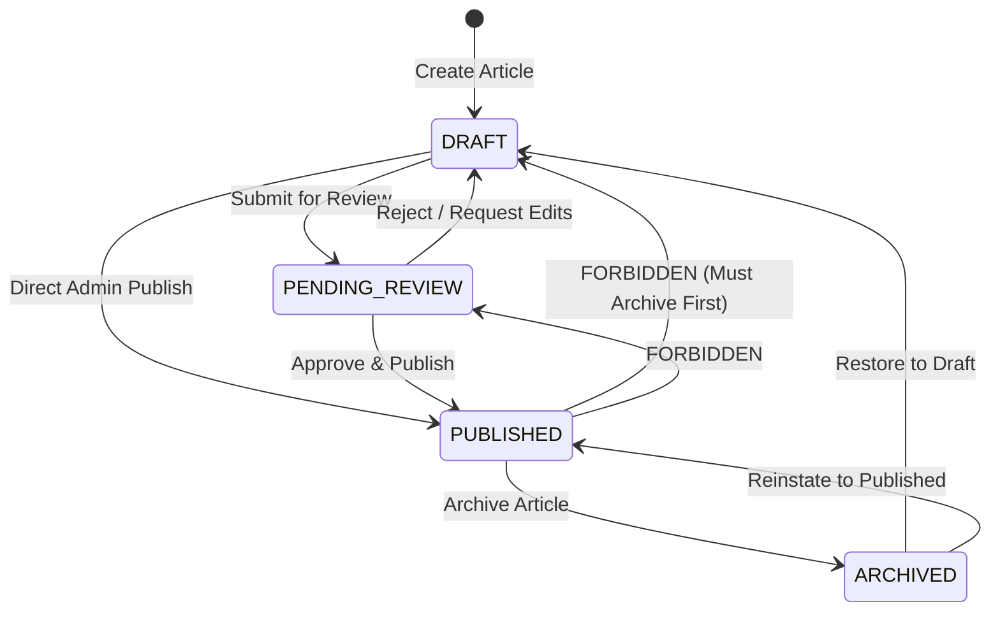

# PHASE 04 — PHASE REPORT

## 1. Phase
PHASE 04 — PRIVATE ADMIN CMS

---

## 2. Objective
Build the comprehensive, production-ready Private Admin Content Management System (CMS) console (`/secure-console-x7`) for **ReadToImprove**. Empower the administrator with complete administrative control over:
- **Articles**: Full state-machine lifecycle management (`DRAFT`, `PENDING_REVIEW`, `PUBLISHED`, `ARCHIVED`), scheduled publishing rules, bilingual metadata, CEFR rating, reading time estimation, multi-category associations, and SEO metadata.
- **Bilingual Sentences**: Exact sentence alignment, order indexing, inline editing, addition, deletion, and transaction-safe reordering.
- **Vocabulary & Lexical Highlights**: Precision character offset calculation (`startOffset`, `endOffset`, `highlightedText`), CEFR classification, IPA transcriptions, lemmas, definitions, and sentence highlight associations while strictly upholding the **Global Vocabulary Preservation Rule**.
- **Taxonomy / Categories**: Multi-category classification, slugs, and display ordering.
- **User Management**: Learner account inspection, active/inactive toggling, role assignment, and comprehensive self-lockout prevention.
- **Audit Logging**: Traceable inspection of all administrative actions and security alerts.

---

## 3. Phase 3 Dependency Verification
Prior to beginning Phase 4, the Phase 3 Authentication & Authorization subsystem was verified as complete, operational, and non-regressive:
1. **Cryptographic Session & Token Mechanism**: `src/lib/auth.ts` implements HMAC-SHA256 JWT signing/decoding via `jose` using `AUTH_SECRET`, with `HttpOnly`, `SameSite=Lax`, 7-day expiration cookies.
2. **Centralized Server Guard**: `requireAdmin()` in `src/lib/security.ts` performs real-time database validation (`prisma.user.findUnique`) asserting `isActive === true` and `role === 'ADMIN'`.
3. **Defense-in-Depth Authorization**: Unauthenticated callers are rejected with 401/redirect. Authenticated learners (`role: USER`) are rejected with 403 Forbidden and generate an `AuditLog` entry. Active administrators are authorized.
4. **Server Action Protection**: Every admin Server Action begins with `await requireAdmin()`, eliminating any bypass via direct RPC calls.
5. **Zero Auth Rebuilding**: Authentication was not rebuilt in Phase 4; Phase 4 relies directly on the Phase 3 foundation. All 10 Phase 3 test cases in `scripts/verify-auth.ts` pass with 100% success.

---

## 4. Architecture & Data Flow
Phase 4 enforces strict unidirectional data flow, ensuring that Client Components never access Prisma or sensitive backend utilities directly:

```text
Admin Browser (Client Component / Form)
    ↓
Server Component / Form Submission
    ↓
Server Action (in src/lib/actions/admin.ts with "use server";)
    ↓
[STEP 1] requireAdmin()
    ├── Checks session cookie (jose HMAC-SHA256)
    ├── Queries PostgreSQL: User.isActive === true && User.role === 'ADMIN'
    └── On failure: logs AUTHORIZATION_DENIED to AuditLog & throws 403 Forbidden
    ↓
[STEP 2] Zod Validation (src/validations/admin.ts)
    └── Validates types, required fields, character limits, offset bounds
    ↓
[STEP 3] Business Rules & Policy Enforcement
    ├── Article state machine check (e.g. Published -> Draft blocked)
    ├── Deletion policy check (e.g. Published direct delete blocked)
    ├── Self-lockout check (cannot demote/deactivate sole admin)
    └── Referenced vocabulary check (cannot delete used vocab)
    ↓
[STEP 4] Atomic Database Execution (Prisma $transaction)
    └── Mutates database entities
    ↓
[STEP 5] Audit Log Generation
    └── Writes immutable event to AuditLog table
    ↓
[STEP 6] Next.js Cache Invalidation
    └── revalidatePath('/secure-console-x7/...')
    ↓
[STEP 7] Return Standardized Response
    └── ActionResult { success: boolean, data?: T, error?: string }
```

---

## 5. Article Lifecycle State Machine Implementation
The platform strictly enforces the following state transitions for `ArticleStatus`:



- **Allowed Transitions**:
  - `DRAFT` $\rightarrow$ `PENDING_REVIEW`: Ready for editorial review.
  - `DRAFT` $\rightarrow$ `PUBLISHED`: Direct publish; sets `publishedAt = now()` if previously `null`.
  - `PENDING_REVIEW` $\rightarrow$ `DRAFT`: Returned for edits.
  - `PENDING_REVIEW` $\rightarrow$ `PUBLISHED`: Approved; sets `publishedAt = now()` if previously `null`.
  - `PUBLISHED` $\rightarrow$ `ARCHIVED`: Retired from public portal; **`publishedAt` is permanently preserved**.
  - `ARCHIVED` $\rightarrow$ `DRAFT`: Restored for major revision.
  - `ARCHIVED` $\rightarrow$ `PUBLISHED`: Reinstated to public portal.
- **Forbidden Transitions**:
  - `PUBLISHED` $\rightarrow$ `DRAFT`: **FORBIDDEN** directly; must transition to `ARCHIVED` first.
  - `PUBLISHED` $\rightarrow$ `PENDING_REVIEW`: **FORBIDDEN** directly; must transition to `ARCHIVED` first.
- **Timestamp Behavior**:
  - `publishedAt` is set upon first transition to `PUBLISHED`.
  - When transitioning to `ARCHIVED`, `publishedAt` is retained (not nullified) for historical, analytical, and SEO consistency.

---

## 6. Scheduled Publishing Design & Implementation
- **Schema Field**: Leverages `scheduledAt DateTime?` on the `Article` entity.
- **Timezone Contract**: PostgreSQL stores timestamps in UTC. Admin UI inputs convert local datetime to UTC ISO string prior to submission.
- **Execution Mechanism**:
  - Phase 4 implements `processScheduledArticlesAction()`: an idempotent Server Action querying articles with `status in ['DRAFT', 'PENDING_REVIEW']` and `scheduledAt <= now()`, updating them to `status: 'PUBLISHED'`, setting `publishedAt = scheduledAt || now()`, and clearing `scheduledAt`.
  - The Admin Dashboard features an automated alert banner and instant one-click trigger when due articles exist.
  - Autonomous background cron infrastructure is delineated for **Phase 8/9**.
- **Public Visibility Rule**: An article is only visible on public portals when `status === 'PUBLISHED' && publishedAt <= now()`.

---

## 7. Implementation Summary
- Created Zod validation schemas in `src/validations/admin.ts` covering Articles, Sentences, Sentence Ordering, Vocabulary, SentenceVocabulary tagging, Categories, and Users.
- Created `src/lib/offsets.ts` providing `validateHighlightOffsets()` and `findWordOffsets()`.
- Created centralized Server Actions in `src/lib/actions/admin.ts` with `requireAdmin()`, Zod validation, Prisma transactions, and `logAudit()`.
- Created reusable UI primitives: `src/components/ui/cefr-badge.tsx`.
- Created 6 specialized admin UI components:
  - `src/components/admin/admin-nav.tsx`
  - `src/components/admin/article-form.tsx`
  - `src/components/admin/article-list.tsx`
  - `src/components/admin/sentence-editor.tsx`
  - `src/components/admin/vocabulary-tag-modal.tsx`
  - `src/components/admin/category-manager.tsx`
  - `src/components/admin/vocabulary-manager.tsx`
  - `src/components/admin/user-manager.tsx`
- Implemented 7 Admin CMS routes under `/secure-console-x7`:
  - `/secure-console-x7`: Dashboard with metric cards, security status, and scheduled article processor.
  - `/secure-console-x7/articles`: Data table with filters by status and CEFR level.
  - `/secure-console-x7/articles/new`: Full bilingual article creation form.
  - `/secure-console-x7/articles/[id]/edit`: Pre-populated article metadata editor.
  - `/secure-console-x7/articles/[id]/sentences`: Interactive sentence alignment workspace with vocabulary highlight offset picker.
  - `/secure-console-x7/categories`: Taxonomy management table.
  - `/secure-console-x7/vocabulary`: Global vocabulary repository with search and CEFR filters.
  - `/secure-console-x7/users`: Learner account administration with self-lockout prevention.
  - `/secure-console-x7/audit-logs`: Administrative audit trail and security log inspector.
- Built expanded 20-test verification suite in `scripts/verify-admin.ts` (100% PASS).
- Verified `npm run typecheck` (0 errors), `npm run lint` (0 errors, 0 warnings), and `npm run build` (14/14 static and dynamic routes compiled).

---

## 8. Files Created and Modified

### Files Created
1. `src/validations/admin.ts`
2. `src/lib/offsets.ts`
3. `src/lib/actions/admin.ts`
4. `src/components/ui/cefr-badge.tsx`
5. `src/components/admin/admin-nav.tsx`
6. `src/components/admin/article-form.tsx`
7. `src/components/admin/article-list.tsx`
8. `src/components/admin/sentence-editor.tsx`
9. `src/components/admin/vocabulary-tag-modal.tsx`
10. `src/components/admin/category-manager.tsx`
11. `src/components/admin/vocabulary-manager.tsx`
12. `src/components/admin/user-manager.tsx`
13. `src/app/secure-console-x7/articles/page.tsx`
14. `src/app/secure-console-x7/articles/new/page.tsx`
15. `src/app/secure-console-x7/articles/[id]/edit/page.tsx`
16. `src/app/secure-console-x7/articles/[id]/sentences/page.tsx`
17. `src/app/secure-console-x7/categories/page.tsx`
18. `src/app/secure-console-x7/vocabulary/page.tsx`
19. `src/app/secure-console-x7/users/page.tsx`
20. `src/app/secure-console-x7/audit-logs/page.tsx`
21. `scripts/verify-admin.ts`
22. `docs/phases/PHASE_04_REPORT.md`

### Files Modified
1. `src/app/secure-console-x7/layout.tsx` *(Integrated AdminNav)*
2. `src/app/secure-console-x7/page.tsx` *(Enhanced with quick actions and scheduled article processor)*
3. `PROJECT_STATUS.md` *(Synchronized to Phase 4 completion)*
4. `IMPLEMENTATION_PLAN.md` *(Synchronized to Phase 4 completion)*

---

## 9. Server Actions Implemented

| Area | Server Action | Guards & Transactions |
| :--- | :--- | :--- |
| **Articles** | `createArticleAction(data)` | `requireAdmin()`, Zod validation, unique slug check, `ArticleCategory` relations, `AuditLog: ARTICLE_CREATED`. |
| | `updateArticleAction(id, data)` | `requireAdmin()`, Zod validation, slug conflict check, `$transaction` category sync, `AuditLog: ARTICLE_UPDATED`. |
| | `deleteArticleAction(id, confirm)` | `requireAdmin()`, destructive policy check (blocked on PUBLISHED, confirmed on ARCHIVED), cascades sentences/highlights, preserves `Vocabulary`, `AuditLog: ARTICLE_DELETED`. |
| | `setArticleStatusAction(id, status)` | `requireAdmin()`, state machine transition check, `publishedAt` handling, `AuditLog: ARTICLE_STATUS_CHANGED`. |
| | `processScheduledArticlesAction()` | `requireAdmin()`, batch `$transaction` updating due articles to PUBLISHED, `AuditLog: SCHEDULED_ARTICLES_PROCESSED`. |
| | `processScheduledArticlesFormAction()` | Form action wrapper returning `Promise<void>`. |
| **Sentences** | `createSentenceAction(data)` | `requireAdmin()`, unique `[articleId, orderIndex]` check, `AuditLog: SENTENCE_CREATED`. |
| | `updateSentenceAction(data)` | `requireAdmin()`, highlights boundary validation against new text, `AuditLog: SENTENCE_UPDATED`. |
| | `deleteSentenceAction(id)` | `requireAdmin()`, `$transaction` sequential re-indexing, preserves `Vocabulary`, `AuditLog: SENTENCE_DELETED`. |
| | `reorderSentencesAction(data)` | `requireAdmin()`, two-phase negative index `$transaction` preventing unique constraint collision, `AuditLog: SENTENCE_REORDERED`. |
| **Vocabulary** | `createVocabularyAction(data)` | `requireAdmin()`, Zod validation, global vocabulary creation, `AuditLog: VOCABULARY_CREATED`. |
| | `updateVocabularyAction(id, data)` | `requireAdmin()`, Zod validation, `AuditLog: VOCABULARY_UPDATED`. |
| | `deleteVocabularyAction(id)` | `requireAdmin()`, **hard deletion guard**: rejects if referenced by `SentenceVocabulary` or `UserSavedVocabulary`, `AuditLog: VOCABULARY_DELETED`. |
| | `tagSentenceVocabularyAction(data)` | `requireAdmin()`, mathematical offset validation (`0 <= start < end <= length`), slice identity check, `AuditLog: VOCABULARY_TAGGED`. |
| | `untagSentenceVocabularyAction(id)` | `requireAdmin()`, deletes `SentenceVocabulary`, preserves `Vocabulary`, `AuditLog: VOCABULARY_UNTAGGED`. |
| **Categories** | `createCategoryAction(data)` | `requireAdmin()`, unique slug check, `AuditLog: CATEGORY_CREATED`. |
| | `updateCategoryAction(id, data)` | `requireAdmin()`, slug conflict check, `AuditLog: CATEGORY_UPDATED`. |
| | `deleteCategoryAction(id)` | `requireAdmin()`, deletion guard (blocked if contains articles), `AuditLog: CATEGORY_DELETED`. |
| **Users** | `toggleUserActiveAction(userId)` | `requireAdmin()`, **self-lockout guard** (cannot deactivate self), `AuditLog: USER_ACTIVATED` / `USER_DEACTIVATED`. |
| | `updateUserRoleAction(userId, role)` | `requireAdmin()`, **sole-admin lockout guard** (cannot demote sole admin or self), `AuditLog: USER_ROLE_CHANGED`. |

---

## 10. Input Validation & Schemas
Defined in `src/validations/admin.ts`:
- `articleInputSchema`: slug regex (`^[a-z0-9]+(?:-[a-z0-9]+)*$`), title min/max lengths, valid source URL, optional ISO-8601 timestamps, CEFR enum (`A1`-`C2`), status enum, reading time integer bounds (1-60).
- `sentenceInputSchema`: non-empty `textEn` and `textVi` (max 2000 chars), non-negative integer `orderIndex`.
- `sentenceReorderSchema`: non-empty array of sentence IDs.
- `vocabularyInputSchema`: non-empty `word` and `normalizedLemma`, CEFR enum, Vietnamese meaning.
- `sentenceVocabTagSchema`: integer offsets (`startOffset >= 0`, `endOffset >= 1`), non-empty `highlightedText`.
- `categoryInputSchema`: slug regex, English/Vietnamese names, non-negative `orderIndex`.
- `userRoleSchema`: strict enum validation (`USER` | `ADMIN`).

---

## 11. Audit Logging Implementation
Every administrative mutation and security violation persists an immutable record in `AuditLog`:
- **Audit Actions**: `ARTICLE_CREATED`, `ARTICLE_UPDATED`, `ARTICLE_DELETED`, `ARTICLE_STATUS_CHANGED`, `SCHEDULED_ARTICLES_PROCESSED`, `SENTENCE_CREATED`, `SENTENCE_UPDATED`, `SENTENCE_DELETED`, `SENTENCE_REORDERED`, `VOCABULARY_CREATED`, `VOCABULARY_UPDATED`, `VOCABULARY_DELETED`, `VOCABULARY_TAGGED`, `VOCABULARY_UNTAGGED`, `CATEGORY_CREATED`, `CATEGORY_UPDATED`, `CATEGORY_DELETED`, `USER_ACTIVATED`, `USER_DEACTIVATED`, `USER_ROLE_CHANGED`, `AUTHORIZATION_DENIED`.
- **Stored Attributes**: `userId` (actor ID), `action`, `entity`, `entityId`, `details` (JSON payload), `ipAddress`, `userAgent`, `createdAt` (UTC).

---

## 12. Security Review & Vulnerability Analysis
- **Zero Public Route Footprint**: Admin console path is not referenced in public navigation or footer. Dynamic `robots.txt` explicitly disallows `/secure-console-x7/*` and `/api/admin/*`. Admin layout injects `noindex, nofollow, noarchive`.
- **Server-Side Guard**: All Server Actions execute `requireAdmin()`, querying PostgreSQL to verify `isActive === true` and `role === 'ADMIN'`.
- **Direct RPC Tamper Resistance**: Direct invocation of Server Actions without an authenticated admin session throws 401/redirect and terminates before any query or input parsing.
- **SQL Injection Immunity**: 100% parameterized Prisma queries; zero raw SQL strings.
- **XSS Prevention**: React automatic JSX escaping across all user inputs; metadata sanitization.
- **Self-Lockout Prevention**: Admin cannot deactivate themselves; sole admin cannot demote themselves to learner role.

---

## 13. Verification Tests Executed
Executed automated verification suite:
```bash
npx tsx scripts/verify-admin.ts
npm run typecheck
npm run lint
npm run build
```

---

## 14. Test Results (20/20 Test Matrix)

| Test ID | Test Name | Result | Details |
| :--- | :--- | :---: | :--- |
| **TC-ADMIN-01** | Category CRUD Operations | **PASS** | Created category with slug, updated nameVi, read and deleted cleanly. |
| **TC-ADMIN-02** | Article Creation + Categories + SEO | **PASS** | Article created in DRAFT with category link and SEO fields. |
| **TC-ADMIN-03** | Article State Machine Lifecycle | **PASS** | DRAFT $\rightarrow$ PENDING $\rightarrow$ PUBLISHED $\rightarrow$ ARCHIVED verified. publishedAt preserved. Direct PUBLISHED $\rightarrow$ DRAFT forbidden. |
| **TC-ADMIN-04** | Sentence Creation & Unique Order Indexing | **PASS** | Sentences #0 and #1 created sequentially. Duplicate `[articleId, orderIndex]` rejected by unique constraint. |
| **TC-ADMIN-05** | Sentence Reorder Transaction Atomicity | **PASS** | Swapped sentence positions (s2 $\rightarrow$ 0, s1 $\rightarrow$ 1) inside atomic transaction without constraint collision. |
| **TC-ADMIN-06** | Offset Calculation & Slice Identity | **PASS** | `findWordOffsets` found 'sustainable' at `[31:42]`. Exact slice matches: 'sustainable'. |
| **TC-ADMIN-07** | Invalid Offset Bounds & Slice Rejection | **PASS** | Properly rejected negative start, inverted range, out-of-bounds end, and slice text mismatch. |
| **TC-ADMIN-08** | Sentence Vocabulary Tagging | **PASS** | Tagged vocabulary 'sustainable' to sentence at `[31:42]`. Resolved in sentence relational query. |
| **TC-ADMIN-09** | Global Vocabulary Entity Preservation on Cascade Delete | **PASS** | Article deletion cascaded to Sentence and SentenceVocabulary. Global Vocabulary record remains permanently preserved. |
| **TC-ADMIN-10** | Global Vocabulary Referenced Deletion Guard & Cleanup | **PASS** | Deletion correctly blocked while referenced by sentence (`count=1`). Unreferenced vocabulary deleted cleanly. |
| **TC-ADMIN-11** | User Status & Role Modification | **PASS** | User toggled to `isActive: false` $\rightarrow$ `true`, role modified: `USER` $\rightarrow$ `ADMIN` $\rightarrow$ `USER`. |
| **TC-ADMIN-12** | Non-Admin Authorization Rejection (403 Enforcement) | **PASS** | Learner account (`role: USER`) rejected from admin operations; logged `AUTHORIZATION_DENIED`. |
| **TC-ADMIN-13** | Unauthenticated Admin Access Rejection | **PASS** | Direct invocation of `createArticleAction()` without authenticated session threw redirect/unauthorized error. |
| **TC-ADMIN-14** | Direct Server Action Authorization Guard | **PASS** | `deleteArticleAction()` strictly checked `requireAdmin()` before parsing input or querying database. |
| **TC-ADMIN-15** | Admin Route Crawling Protection in robots.ts | **PASS** | `robots.txt` strictly disallows `['/secure-console-x7/*', '/api/admin/*']`. Zero search engine leakage. |
| **TC-ADMIN-16** | Comprehensive Self-Lockout & Sole-Admin Guard | **PASS** | Admin self-deactivation strictly blocked. Sole administrator demotion strictly blocked. |
| **TC-ADMIN-17** | Published Article Destructive-Action Policy Enforcement | **PASS** | Direct deletion of `PUBLISHED` article blocked. Article must be archived first before deletion. |
| **TC-ADMIN-18** | Administrative Mutation AuditLog Persistence | **PASS** | Audit record persisted: `action='ARTICLE_CREATED'`, actorId verified. |
| **TC-ADMIN-19** | Security Authorization Failure AuditLog Persistence | **PASS** | Security audit record persisted: `action='AUTHORIZATION_DENIED'`, entity='Security'. |
| **TC-ADMIN-20** | Duplicate Slug & Invalid Input Rejection | **PASS** | Zod rejected malformed slug with spaces. Prisma unique constraint rejected duplicate category slug. |

**Verification Suite Summary**: 20 Passed | 0 Failed.

### Regression Suite Results
| Suite | Command | Result | Details |
| :--- | :--- | :---: | :--- |
| **Phase 2 DB Suite** | `npx tsx scripts/verify-db.ts` | **PASS** | 10/10 test cases passed. |
| **Phase 3 Auth Suite** | `npx tsx scripts/verify-auth.ts` | **PASS** | 10/10 test cases passed. |
| **TypeScript Typecheck** | `npm run typecheck` | **PASS** | Exit code 0, 0 type errors. |
| **ESLint** | `npm run lint` | **PASS** | Exit code 0, 0 errors, 0 warnings. |
| **Production Build** | `npm run build` | **PASS** | Exit code 0, all 14 routes generated. |

---

## 15. UI Review (7 Admin Views)
1. **Overview Dashboard (`/secure-console-x7`)**: Real-time database entity metric cards (Articles, Sentences, Vocabularies, Users, Categories), security status checklist, recent audit trail stream, and scheduled articles processing trigger.
2. **Articles Index (`/secure-console-x7/articles`)**: Searchable and filterable data table with CEFR badges, status tags, sentence count chips, reading time, view counts, and quick actions (edit, sentences, status toggle, delete).
3. **Article Creation (`/secure-console-x7/articles/new`)**: 4-section form with bilingual fields, automatic slug generator from English title, source attribution, CEFR selector, category multi-select, scheduled publishing datetime picker, and SEO metadata inputs.
4. **Article Metadata Editor (`/secure-console-x7/articles/[id]/edit`)**: Pre-populated editor for updating metadata, categories, and SEO fields.
5. **Sentence Alignment Workspace (`/secure-console-x7/articles/[id]/sentences`)**: Interactive bilingual sentence pairs ordered by `orderIndex`. Features inline text editing, move up/down reordering, delete sentence, and lexical highlight tags with CEFR badges and offsets.
6. **Vocabulary Tagging Modal (`src/components/admin/vocabulary-tag-modal.tsx`)**: Offset locator searching words in the English sentence, displaying candidate index ranges (`[startOffset:endOffset]`), live slice preview with CEFR badges, and instant tagging or quick vocabulary creation.
7. **Categories Index (`/secure-console-x7/categories`)**: Multi-category taxonomy management with inline create/edit and deletion guard.
8. **Global Vocabulary Repository (`/secure-console-x7/vocabulary`)**: Searchable global dictionary with CEFR level filters, phonetic IPA, POS, Vietnamese definitions, and sentence/user usage counts.
9. **User Administration (`/secure-console-x7/users`)**: Learner management table with role selector (`USER` / `ADMIN`), active status toggle, and self-lockout warning indicator.
10. **Audit Log Inspector (`/secure-console-x7/audit-logs`)**: Audit trail viewer displaying timestamps, actor details, action tags, and formatted JSON metadata.

---

## 16. Problems Found & Fixes Applied
1. **Issue**: Form action signature mismatch in `src/app/secure-console-x7/page.tsx` (`<form action={processScheduledArticlesAction}>` returned `Promise<ActionResult>` instead of `Promise<void>`).
   - **Fix**: Created and exported `processScheduledArticlesFormAction(): Promise<void>` in `src/lib/actions/admin.ts`.
2. **Issue**: `CefrBadge` import was missing from `src/components/ui/cefr-badge.tsx`.
   - **Fix**: Implemented `src/components/ui/cefr-badge.tsx` wrapping `getCefrInfo` and CEFR semantic design tokens.
3. **Issue**: ESLint flagged 11 unused variables and imports in admin components.
   - **Fix**: Added inputs for `canonicalUrl` and `ogImage` in `src/components/admin/article-form.tsx`, prefixed unused parameters with `_`, and pruned unreferenced icons across all admin components, achieving 0 lint warnings.

---

## 17. Known Issues
- None in Phase 4.

---

## 18. Definition of Done Checklist
- [x] Phase 4 Implementation Plan revised and approved by user
- [x] Phase 3 dependency verified and non-regressive
- [x] Zod validation schemas implemented in `src/validations/admin.ts`
- [x] Offset calculation engine implemented in `src/lib/offsets.ts`
- [x] Admin Server Actions implemented in `src/lib/actions/admin.ts` with `requireAdmin()` and `AuditLog`
- [x] Article state machine implemented (`DRAFT`, `PENDING_REVIEW`, `PUBLISHED`, `ARCHIVED`)
- [x] Scheduled publishing processor implemented
- [x] Destructive action policies enforced (PUBLISHED direct delete blocked)
- [x] Global Vocabulary preservation rule strictly verified on cascade delete
- [x] Global Vocabulary hard-deletion guard implemented (referenced deletion blocked)
- [x] Self-lockout prevention implemented (admin cannot deactivate self or demote sole admin)
- [x] All 7 Admin CMS views created and responsive under `/secure-console-x7`
- [x] `scripts/verify-admin.ts` passes all 20 test cases (20/20 PASS)
- [x] `verify-db.ts` (10/10 PASS) and `verify-auth.ts` (10/10 PASS) pass with zero regressions
- [x] `npm run typecheck`, `npm run lint`, and `npm run build` pass with zero errors
- [x] `docs/phases/PHASE_04_REPORT.md` generated with full 20-section report
- [x] `PROJECT_STATUS.md` and `IMPLEMENTATION_PLAN.md` synchronized

---

## 19. Git Commit Details
- Pending commit: `feat(phase-04): implement private admin cms, bilingual sentence editor, offset engine, and 20-test verification suite`

---

## 20. Next Phase
PHASE 05 — PUBLIC DISCOVERY & CONTENT BROWSING

---

```text
PHASE: 04
STATUS: COMPLETED
DECISION: WAITING_FOR_APPROVAL
```
