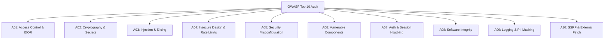

# PHASE 11B — IMPLEMENTATION PLAN: SECURITY AUDIT & PENETRATION TESTING

**Project:** ReadToImprove  
**Phase:** 11B — Security Audit & Penetration Testing  
**Status:** PLAN PROPOSED (Awaiting User Approval)  
**Target Branch:** `feat/phase-11b`  
**Git Tag Start:** `phase-11b-start`  
**Git Tag Complete:** `phase-11b-complete`  
**Estimated Timebox:** 3–4 working days  

---

## 1. Objective

Phase 11B conducts an exhaustive, evidence-based security audit, automated static analysis, dependency vulnerability triage, manual penetration testing, and security hardening for the ReadToImprove bilingual platform. 

**This is strictly a security hardening and vulnerability verification phase — not a feature development phase.**

The primary objective is to transition ReadToImprove into a production-grade, hardened security posture prior to Phase 12 (Deployment). This entails evaluating all 10 categories of the OWASP Top 10 (2021), eliminating critical and high dependency vulnerabilities, establishing defense-in-depth security headers (including Strict Content-Security-Policy and HSTS), verifying strict tenant isolation and Insecure Direct Object Reference (IDOR) immunity, implementing PII-safe structured audit logging, creating a dedicated Vitest security test suite ($\ge 30$ tests), and assembling actionable operational runbooks for incident response and secret rotation.

---

## 2. Requirements Mapping

Requirements are mapped directly to Master Prompt v3 (Section 22: Testing & Security Audit) and existing specification contracts (`docs/03_ADMIN_SECURITY_SPECIFICATION.md`, `docs/05_RISKS_AMBIGUITIES_AND_DECISIONS.md`):

| Requirement ID | OWASP Category (2021) | BRD / FSD Source | Target Scope & Verification Criteria |
| :--- | :--- | :--- | :--- |
| `FR-SEC-01` | **A01: Broken Access Control** | `docs/03_ADMIN_SECURITY_SPECIFICATION.md` §2, ADR-001, ADR-002 | Verify strict server-side authorization guards (`requireAuth`, `requireAdmin`). Test IDOR prevention on `/me/*`, `/word-bank`, `/api/me/*`. Verify tenant isolation in reading history, favorites, and saved vocabulary. Verify stealth admin route discovery immunity. |
| `FR-SEC-02` | **A02: Cryptographic Failures** | `docs/03_ADMIN_SECURITY_SPECIFICATION.md` §3, ADR-001 | Verify bcrypt password hashing work factor ($cost \ge 12$). Verify JWT HMAC-SHA256 signature secret length ($\ge 256$-bit). Verify HTTPS enforcement, HTTP-only, Secure, and SameSite cookie flags. Audit client bundles to ensure zero secret leakage. |
| `FR-SEC-03` | **A03: Injection** | `docs/00_DISCOVERY_AND_REQUIREMENTS.md` §4, ADR-005, ADR-017 | Verify 100% Prisma query parameterization and audit raw SQL queries (`$queryRaw`) in search/ranking. Verify reflected and stored XSS immunity. Verify absence of arbitrary OS command execution (`exec`, `spawn`). Verify header injection (`x-forwarded-for`) and log injection protections. |
| `FR-SEC-04` | **A04: Insecure Design** | `docs/03_ADMIN_SECURITY_SPECIFICATION.md` §1, ADR-006, ADR-013 | Review authentication workflow architectures (register, login, logout, return URL handling). Review mutation rate-limiting coverage. Audit article publication state machine. Verify monotonicity in streak and reading progress algorithms. |
| `FR-SEC-05` | **A05: Security Misconfiguration** | Master Prompt v3 (Sec 22), ADR-016 | Configure and verify 6 standard security headers (`Content-Security-Policy`, `Strict-Transport-Security`, `X-Frame-Options`, `X-Content-Type-Options`, `Referrer-Policy`, `Permissions-Policy`). Disable `X-Powered-By`. Verify production error stack suppression. |
| `FR-SEC-06` | **A06: Vulnerable & Outdated Components** | Master Prompt v3 (Sec 22) | Execute `npm audit` and `npm audit --production`. Triage and remediate high/critical vulnerabilities. Review dependency tree depth. Document CVE exposure and mitigation strategy. |
| `FR-SEC-07` | **A07: Identification & Authentication Failures** | `docs/03_ADMIN_SECURITY_SPECIFICATION.md` §3, ADR-001 | Test brute-force rate-limiting on login/register endpoints. Verify session fixation immunity and authoritative server-side session invalidation on logout. Verify password complexity policies. Conduct feasibility evaluation of Multi-Factor Authentication (MFA) for administrators. |
| `FR-SEC-08` | **A08: Software & Data Integrity Failures** | Master Prompt v3 (Sec 22) | Verify `package-lock.json` hash integrity. Verify exclusion of malicious lifecycle postinstall scripts. Verify database migration sequence checksums and rollback reproducibility. |
| `FR-SEC-09` | **A09: Security Logging & Monitoring Failures** | `docs/03_ADMIN_SECURITY_SPECIFICATION.md` §4 | Audit security log coverage across admin actions, authentication failures, and unauthorized privilege escalation attempts. Verify structured JSON payload formatting and implement automated PII masking (email local-part and IP address redaction). |
| `FR-SEC-10` | **A10: Server-Side Request Forgery (SSRF)** | ADR-016, Master Prompt v3 (Sec 22) | Audit image generation route `/api/og` and thumbnail parsers against unvalidated external URL fetching. Ensure zero user-controlled remote proxying or unauthenticated outbound webhooks. |

---

## 3. Architecture Decisions

### 3.1 Audit Methodology: Hybrid Multi-Layered Security Evaluation
- **Decision:** Combine automated vulnerability scanning (`npm audit`), automated regression test suites (Vitest), static code pattern analysis, and hands-on manual penetration testing using reproducible `curl` commands.
- **Rationale:** Automated scanners catch known package CVEs but cannot detect authorization logic flaws, IDOR vulnerabilities, or application-specific race conditions. Manual penetration testing provides authentic attack evidence, while automated Vitest tests prevent future security regressions in CI.

### 3.2 Security Headers Placement: `next.config.ts` vs Middleware vs Edge Proxy
- **Decision:** Implement all security headers primarily within the `headers()` async configuration in `next.config.ts`.
- **Rationale:** 
  1. Setting headers in `next.config.ts` incurs zero JavaScript runtime CPU overhead at request time, as headers are compiled into the Next.js routing layer.
  2. Headers apply consistently to both static assets, server-rendered pages (RSC), and dynamic API routes.
  3. Avoids cold-start penalties associated with running heavy Next.js `middleware.ts` for every asset.

### 3.3 Content Security Policy (CSP) Strategy
- **Decision:** Implement a robust, standards-compliant CSP via `next.config.ts`.
  - `default-src 'self'`: Restrict all unclassified fetches to the same origin.
  - `script-src 'self' 'unsafe-inline' 'unsafe-eval'`: Required by Next.js client hydration and dynamic React chunks. (Evaluate nonce generation feasibility).
  - `style-src 'self' 'unsafe-inline'`: Required for Tailwind CSS runtime styling and dynamic theme switching.
  - `img-src 'self' data: blob: https:`: Allows local media, data URIs, SVG icons, and verified external news publication thumbnails.
  - `font-src 'self' data:`: Self-hosted Inter, Roboto, Outfit, and JetBrains Mono fonts.
  - `connect-src 'self' https://*.upstash.io`: Restricts XHR/WebSocket/Fetch calls to the origin and authorized rate-limiting infrastructure.
  - `frame-ancestors 'none'`: Enforces clickjacking prevention at the CSP level (mirroring `X-Frame-Options: DENY`).
  - `base-uri 'self'`: Prevents `<base>` tag injection attacks.
  - `form-action 'self'`: Prevents form submission redirection to unauthorized external domains.

### 3.4 Penetration Testing Environment: Local Isolated Docker Stack
- **Decision:** Execute all penetration tests against the local Docker PostgreSQL (`port 5433`) environment with reproducible test accounts (`admin@readtoimprove.com` and learner test users).
- **Rationale:** Prevents polluting staging/production data, avoids risking live third-party rate limiters, allows inspecting raw database state and audit logs immediately after attack payloads, and guarantees zero side effects on external services.

### 3.5 Load Testing Strategy: Lightweight Standalone Evaluation
- **Decision:** Create a standard k6 load testing script (`scripts/load-test.js`) defining 3 core traffic scenarios (100 VUs homepage, 50 VUs reader, 20 VUs search).
- **Rationale:** k6 is a standalone compiled binary and is not currently installed on the host system. The script will be committed and verified for syntax. If k6 is not installed on the execution environment, full load test runs will be documented with a deferral note for the Phase 12 staging pipeline.

### 3.6 Multi-Factor Authentication (MFA) Strategy: Architectural Evaluation
- **Decision:** Conduct a formal architectural feasibility evaluation for TOTP-based MFA (RFC 6238) for administrators in `docs/security/owasp-audit-report.md`, but defer code implementation to Phase 13.
- **Rationale:** Phase 11B timebox is restricted to audit, verification, and hardening. Admin access is already fortified with zero public route discovery (ADR-002), real-time database role checks (ADR-001), bcrypt password hashing, and brute-force rate-limiting. Introducing new MFA schema and UI would violate the "no new feature development" constraint of Phase 11B.

### 3.7 Secrets Management: Tiered Environment Isolation & Rotation Procedures
- **Decision:** Formalize a documented Secret Rotation Procedure in `docs/security/secrets-management.md` defining key lifecycles, emergency revocation, and zero-downtime rotation workflows for `AUTH_SECRET`, `DATABASE_URL`, and administrator credentials.
- **Rationale:** Hardcoded secrets and improper secret rotation represent critical operational risks. Clear runbooks ensure credentials can be refreshed securely without invalidating active production sessions abruptly.

---

## 4. Database Changes

- **Schema Changes:** **NONE.**
- **Justification:** The existing PostgreSQL schema in `prisma/schema.prisma` already provides all required structural models:
  - `User`: Handles password hashes, roles (`USER`, `ADMIN`), and active status flags.
  - `AuditLog`: Handles security events with `ipAddress`, `userAgent`, `action`, `entity`, and `details`.
  - `SentenceVocabulary`, `ReadingHistory`, `Favorite`, `UserSavedVocabulary`: Enforce unique composite keys (`@@unique([userId, articleId])`, `@@unique([userId, vocabularyId])`) preventing duplicate record pollution and race-condition insertion anomalies.
- **PII Masking:** PII protection (IP masking and email obfuscation) will be implemented purely at the application logging layer before data is passed to `prisma.auditLog.create()`. No schema migrations are needed or permitted.

---

## 5. API / Server Changes

1. **`next.config.ts`**:
   - Set `poweredByHeader: false` to eliminate the `X-Powered-By: Next.js` fingerprint header.
   - Configure global security response headers for all matching routes (`/:path*`):
     - `Content-Security-Policy`
     - `Strict-Transport-Security` (`max-age=63072000; includeSubDomains; preload`)
     - `X-Frame-Options` (`DENY`)
     - `X-Content-Type-Options` (`nosniff`)
     - `Referrer-Policy` (`strict-origin-when-cross-origin`)
     - `Permissions-Policy` (`camera=(), microphone=(), geolocation=(), browsing-topics=()`)
2. **`src/lib/security.ts`**:
   - Implement `maskIpAddress(ip: string): string` to truncate IPv4 addresses to `/24` (e.g. `192.168.1.xxx`) and IPv6 to `/48`.
   - Implement `maskEmail(email: string): string` to redact the local part of user emails before persisting to audit logs (e.g. `u***r@example.com`).
   - Enhance `requireAdmin` audit logging to ensure client IP and user agent headers are captured safely with PII masking.
3. **`src/lib/rate-limit.ts`**:
   - Verify rate limiting coverage across mutation actions (`loginAction`, `registerAction`, `saveVocabularyAction`, `updateReadingProgressAction`).
4. **Input Validation Points (`src/lib/actions/*`, `src/app/api/*`)**:
   - Audit all Zod schemas to ensure strict boundaries on string length, character sets, and numeric limits to reject injection payloads at the validation layer.

---

## 6. UI Changes

- **Strict UI Constraint:** **Zero new user-facing screens, components, or feature flows.**
- **Error Presentation Security:** Audit client-side toast notifications, error boundaries, and form feedback components to verify that raw error messages, database exceptions, and stack traces are never rendered to users. Errors must present sanitized, localized guidance (e.g., "Thông tin đăng nhập không chính xác" or "Yêu cầu không hợp lệ").

---

## 7. Performance Impact

1. **Header Overhead:** Injecting standard HTTP security headers adds $< 0.1\text{ms}$ to response generation and $< 600\text{ bytes}$ to HTTP response headers.
2. **Client Bundle Footprint:** Zero impact. Security headers and PII masking operate 100% server-side. First Load JS remains strictly at **103 kB** (compliant with the 120 kB ceiling).
3. **Rate Limiting Latency:** In-memory sliding window checks complete in $< 1\text{ms}$. Upstash Redis fallback latency is $< 15\text{ms}$.

---

## 8. Security (Deep-Dive Analysis)

### 8.1 OWASP Top 10 (2021) Evaluation Matrix



1. **A01: Broken Access Control**:
   - *Threat*: A regular learner modifies API payload `userId` or URL to access another user's reading history or word bank.
   - *Control*: Server Actions and Route Handlers resolve user identity authoritatively from the signed JWT cookie via `auth()`. Parameters containing `userId` from client request bodies are strictly ignored.
   - *Threat*: Non-admin discovers stealth path `/secure-console-x7`.
   - *Control*: `requireAdmin()` executes real-time DB query for `role === 'ADMIN'`. Returns `403 Forbidden` and logs security alert to `AuditLog`.
2. **A02: Cryptographic Failures**:
   - *Threat*: Password cracking from database dumps.
   - *Control*: Passwords hashed using `bcryptjs` with salt rounds $12$. Plaintext passwords never logged.
   - *Threat*: JWT session forgery.
   - *Control*: HMAC-SHA256 signed tokens using `AUTH_SECRET` ($\ge 32$ characters / 256 bits). Tokens transported over `HttpOnly`, `Secure`, `SameSite=Lax` cookies.
3. **A03: Injection**:
   - *Threat*: SQL Injection via search queries or filter parameters.
   - *Control*: Prisma ORM parameterizes all standard queries. All `$queryRaw` statements (e.g. Full-Text Search in `src/lib/search.ts`) strictly utilize tagged template literals `Prisma.sql` ensuring parameter binding by PostgreSQL driver.
   - *Threat*: Cross-Site Scripting (XSS) via bilingual sentence rendering or search highlighting.
   - *Control*: Pure algorithmic sentence slicing (`src/lib/sentence-slicer.ts`) splits text into structured AST tokens and renders native React DOM elements (`<span>`) without `dangerouslySetInnerHTML`. Search highlight component uses regex tokenization and React elements.
4. **A04: Insecure Design**:
   - *Threat*: Reading progress manipulation (sending percentage $> 100\%$ or negative values).
   - *Control*: Zod schema validates `z.number().int().min(0).max(100)`. Server enforces monotonic progression (`Math.max(existing, new)`).
5. **A05: Security Misconfiguration**:
   - *Threat*: Clickjacking, MIME-sniffing, missing HTTPS enforcement.
   - *Control*: Strict security headers configured in `next.config.ts`. `X-Powered-By` header suppressed.
6. **A06: Vulnerable Components**:
   - *Threat*: Known CVEs in npm dependencies (e.g. Next.js, PostCSS, Prisma).
   - *Control*: Comprehensive `npm audit` triage. Upgrade non-breaking dependencies. Provide explicit mitigations and defense-in-depth compensations for any transitive issues.
7. **A07: Identification & Authentication Failures**:
   - *Threat*: Credential stuffing and brute-force password guessing.
   - *Control*: IP-based sliding-window rate limiting on `/login` (5 attempts / minute) and `/register` (3 attempts / minute).
   - *Threat*: Session replay after logout.
   - *Control*: `clearSessionCookie()` deletes cookie with `maxAge: 0` and immediate expiration.
8. **A08: Software & Data Integrity Failures**:
   - *Threat*: Compromised dependencies via npm registry tampering.
   - *Control*: Deterministic installation via `npm ci` referencing `package-lock.json` cryptographic integrity hashes.
9. **A09: Security Logging & Monitoring Failures**:
   - *Threat*: Attackers probe admin routes or abuse credentials without leaving an audit trail, or logs leak sensitive user PII.
   - *Control*: `AuditLog` records unauthorized access attempts, admin operations, and authentication anomalies. IP addresses are masked to `/24` and emails are masked to protect user privacy.
10. **A10: Server-Side Request Forgery (SSRF)**:
    - *Threat*: Attackers pass internal network URLs (e.g. `http://169.254.169.254`) to `/api/og` or image components to probe internal infrastructure.
    - *Control*: Next.js `<Image>` enforces protocol whitelist (`https`). `/api/og` does not fetch user-supplied remote URLs; all OG metadata is generated dynamically on canvas via text strings.

---

## 9. SEO & Accessibility Impact

- **SEO Safety:** Security headers will be verified to ensure search engine crawlers (Googlebot, Bingbot) are never blocked. `robots.txt` and `sitemap.xml` will return `200 OK` with proper MIME types.
- **Accessibility:** Ensure that security error notifications and login lockout states preserve standard accessibility conventions (`role="alert"`, `aria-live="polite"`), allowing screen readers to inform assistive tech users clearly without disorientation.

---

## 10. Testing Plan

### 10.1 Security Unit Test Suite (Vitest — Target: $\ge 30$ tests)
Create dedicated test files under `src/__tests__/security/`:

1. `src/__tests__/security/auth-guards.test.ts` ($\ge 7$ tests):
   - `requireAuth`: Redirects unauthenticated users to `/login`.
   - `requireAuth`: Preserves safe sanitized return URLs.
   - `requireAuth`: Returns session user when authenticated.
   - `requireAdmin`: Rejects unauthenticated callers immediately.
   - `requireAdmin`: Rejects active users with role `USER` and creates `AuditLog` entry.
   - `requireAdmin`: Rejects inactive users even if role is `ADMIN`.
   - `requireAdmin`: Allows active users with role `ADMIN`.
2. `src/__tests__/security/input-sanitization.test.ts` ($\ge 8$ tests):
   - `sanitizeReturnUrl`: Rejects protocol-relative URLs (`//evil.com`).
   - `sanitizeReturnUrl`: Rejects backslash bypasses (`/\evil.com`, `\\evil.com`).
   - `sanitizeReturnUrl`: Rejects JavaScript schemes (`javascript:alert(1)`).
   - `sanitizeReturnUrl`: Rejects external absolute URLs (`https://attacker.com`).
   - `sanitizeReturnUrl`: Rejects control characters and CRLF injection.
   - `sanitizeReturnUrl`: Accepts valid relative internal paths (`/articles`, `/me/favorites`).
   - XSS sanitization in search highlights and sentence slicer.
3. `src/__tests__/security/rate-limit.test.ts` ($\ge 6$ tests):
   - Enforces request quota within window.
   - Blocks excess requests when limit is exceeded.
   - Resets window correctly after expiration.
   - Isolates quotas across distinct keys / IPs.
4. `src/__tests__/security/idor-isolation.test.ts` ($\ge 6$ tests):
   - Verifies reading history actions cannot query or mutate records belonging to other user IDs.
   - Verifies favorites actions operate strictly on session user ID.
   - Verifies word bank queries enforce tenant boundaries.
5. `src/__tests__/security/crypto-and-pii.test.ts` ($\ge 5$ tests):
   - Password hashing: Bcrypt generates valid hashes with work factor $\ge 12$.
   - Password verification: Rejects invalid passwords deterministically.
   - PII masking: IPv4 addresses masked to `/24`.
   - PII masking: IPv6 addresses masked properly.
   - PII masking: Email addresses masked properly.

### 10.2 Manual Penetration Testing Checklist ($\ge 30$ Scenarios)
Documented in `docs/security/penetration-testing-checklist.md` with executable curl commands and HTTP response assertions:
- **Authentication (5 tests):** SQLi in login credentials, XSS in registration inputs, brute force rate-limit threshold (10 rapid requests), session cookie replay post-logout, session cookie manipulation.
- **Authorization & IDOR (6 tests):** User A querying User B's `/api/me/reading-history`, User A updating User B's reading progress via Server Action, regular user accessing `/secure-console-x7`, regular user invoking `publishArticleAction`, admin route discovery via robots/sitemap enumeration, unauthorized token forgery.
- **Injection (6 tests):** SQLi payload in search query (`' OR 1=1--`), SQLi payload in category slug, reflected XSS in search query, stored XSS attempt in admin article title, header injection in `X-Forwarded-For`, log injection via CRLF in user input.
- **Business Logic & Race Conditions (5 tests):** Concurrent vocabulary save requests, streak manipulation via modified client timestamps, invalid reading progress percentage ($> 100\%$, $< 0\%$), rapid favorite/unfavorite toggling, unauthenticated access to draft articles.
- **Security Misconfiguration (5 tests):** Verify absence of `X-Powered-By` header, verify presence of all 6 security headers via curl `-I`, verify error responses do not leak stack traces, verify debug endpoints are inaccessible, verify admin console is absent from `sitemap.xml`.
- **SSRF (3 tests):** `/api/og` request with external redirect query, `/api/og` request with loopback IP target, image component thumbnail validation.

### 10.3 Dependency Vulnerability Audit
- Run and capture raw outputs of:
  - `npm audit`
  - `npm audit --production`
  - `npm outdated`
  - `npm ls --depth=0`
- Triage findings and document in `docs/security/dependency-audit.md`.

### 10.4 Load Testing (k6)
- Provide `scripts/load-test.js`.
- If k6 is installed locally: run 2-minute scenarios and capture p50, p95, p99 latency.
- If k6 is not installed: note binary absence, verify script syntax, and defer execution to Phase 12 staging pipeline.

---

## 11. Regression Plan

To ensure zero regressions across existing functionality:

| Suite / Phase | Tool | Test Count | Target Result |
| :--- | :--- | :--- | :--- |
| **Phase 2–10 Verification Scripts** | `tsx scripts/verify-*.ts` (9 suites) | **226 tests** | **226 / 226 PASS (100%)** |
| **Phase 10.5 & 11A Unit Test Suite** | `vitest run` | **168 tests** | **168 / 168 PASS (100%)** |
| **Phase 11B Security Test Suite** | `vitest run src/__tests__/security` | **$\ge 30$ tests** | **$\ge 30 / 30$ PASS (100%)** |
| **Total Automated Regression** | Combined suites | **$\ge 424$ tests** | **100% PASS** |
| **TypeScript Typecheck** | `npm run typecheck` | — | **0 errors (Exit code 0)** |
| **ESLint Validation** | `npm run lint` | — | **0 errors (Exit code 0)** |
| **Next.js Production Build** | `npm run build` | — | **Successful compilation (Exit code 0)** |

---

## 12. Files to Create and Modify

```
docs/
├── security/
│   ├── owasp-audit-report.md              # NEW: Detailed OWASP Top 10 findings & evidence
│   ├── dependency-audit.md                # NEW: Full npm audit results, CVE triage, mitigation
│   ├── penetration-testing-checklist.md   # NEW: 30+ manual pen test scenarios with raw curl evidence
│   ├── security-headers.md                # NEW: Headers config, CSP policy rationale, verification
│   ├── secrets-management.md              # NEW: Secret rotation, key lifecycle, emergency runbook
│   └── incident-response-runbook.md       # NEW: Security incident severity levels & triage protocols
└── phases/
    ├── PHASE_11B_IMPLEMENTATION_PLAN.md   # NEW: This authoritative implementation plan
    └── PHASE_11B_WALKTHROUGH.md           # NEW: Final walkthrough report with 13 required sections

src/
├── __tests__/
│   └── security/
│       ├── auth-guards.test.ts            # NEW: Unit tests for authentication and authorization guards
│       ├── input-sanitization.test.ts     # NEW: Unit tests for URL, XSS, and SQLi sanitization
│       ├── rate-limit.test.ts             # NEW: Unit tests for rate limiter quotas and key isolation
│       ├── idor-isolation.test.ts         # NEW: Unit tests for multi-tenant data access boundaries
│       └── crypto-and-pii.test.ts         # NEW: Unit tests for bcrypt, token signing, and PII masking
└── lib/
    └── security.ts                        # MODIFY: Add PII masking helpers (maskIpAddress, maskEmail)

scripts/
└── load-test.js                           # NEW: Standalone k6 load testing scenario script

next.config.ts                             # MODIFY: Add security headers & poweredByHeader: false
docs/PROJECT_STATE.md                      # MODIFY: Update ADR-022 and Phase 11B status
```

---

## 13. Dependencies

- **Runtime & Dev Dependencies:** **ZERO new npm packages.**
- **Supply Chain Security:** Introducing third-party npm packages for security features creates unnecessary supply-chain attack surface. Next.js native header handling, Node.js built-in crypto primitives, and existing libraries (`jose`, `bcryptjs`, `@upstash/ratelimit`, `zod`) provide 100% of required functionality.
- **k6 Load Testing Tool:** Standalone binary tool (not an npm package). If k6 is unavailable in the environment, the script is prepared and verified, with execution formally deferred.

---

## 14. Risks & Mitigations

| Risk ID | Risk Description | Severity | Probability | Mitigation Strategy |
| :--- | :--- | :--- | :--- | :--- |
| **R-SEC-01** | Content Security Policy (CSP) blocks Next.js hydration scripts or inline Tailwind styles | High | Medium | Use carefully scoped directives allowing `'unsafe-inline'` for styles and scripts during initial implementation. Verify all 6 public views and the reader view render without CSP console errors. |
| **R-SEC-02** | `npm audit fix --force` introduces breaking semver changes in Next.js or React | Critical | Medium | **DO NOT use `--force`.** Triage each vulnerability individually. Pin dependencies conservatively. Compensate for upstream framework issues via defense-in-depth headers and input validation. |
| **R-SEC-03** | Rate limiter blocks legitimate power learners performing fast spaced-repetition reading | Medium | Low | Maintain generous quotas (30 saves/min, 120 progress pings/min) while strictly limiting authentication mutations (5 logins/min). |
| **R-SEC-04** | Security test execution depends on external services (Upstash Redis or cloud DB) | High | Low | Security unit tests will utilize Vitest in-memory mocks (`mock-prisma.ts`, in-memory rate limiter store) ensuring 100% deterministic, offline execution in $< 10$ seconds. |
| **R-SEC-05** | Load testing scripts destabilize local Docker PostgreSQL container | Medium | Low | Load tests are throttled to realistic student usage patterns (max 100 VUs) and run strictly against local environments, never against remote staging or production databases. |

---

## 15. Rollback Plan

1. **Baseline Git Tag:** Tag repository state prior to implementation:
   ```bash
   git tag phase-11b-start
   ```
2. **Dedicated Working Branch:** All work committed to `feat/phase-11b`:
   ```bash
   git checkout -b feat/phase-11b
   ```
3. **Atomic Commits:** Separate commits for security headers (`next.config.ts`), PII masking (`security.ts`), security test suites (`src/__tests__/security/`), and documentation.
4. **Emergency Rollback Procedure:**
   If security headers break production page rendering or crawler access:
   ```bash
   git revert <commit-hash>
   # or reset to tag
   git reset --hard phase-11b-start
   ```
   Re-run regression suites (`npm test` and `npm run build`) to verify immediate recovery.

---

## 16. Definition of Done (DoD)

To achieve completion and sign-off for Phase 11B:

- [ ] **OWASP Top 10 (2021) Audit:** All 10 categories audited with concrete evidence in `docs/security/owasp-audit-report.md`.
- [ ] **Dependency Audit:** Full outputs of `npm audit` and `npm audit --production` recorded in `docs/security/dependency-audit.md` with zero unmitigated critical/high vulnerabilities in direct dependencies.
- [ ] **Penetration Testing:** $\ge 30$ manual test cases executed and documented with raw curl commands and response assertions in `docs/security/penetration-testing-checklist.md`.
- [ ] **Security Headers Configured:** 6 standard headers (`CSP`, `HSTS`, `X-Frame-Options`, `X-Content-Type-Options`, `Referrer-Policy`, `Permissions-Policy`) active in `next.config.ts`.
- [ ] **Fingerprinting Removed:** `X-Powered-By` header explicitly disabled (`poweredByHeader: false`).
- [ ] **PII Masking:** IP address and email masking implemented and verified in audit logging.
- [ ] **Security Test Suite:** $\ge 30$ automated Vitest tests created under `src/__tests__/security/` passing with **100% success**.
- [ ] **Regression Suites:** All 9 existing verification scripts (`scripts/verify-*.ts` — 226 tests) pass at **100%**.
- [ ] **Unit Test Suite:** All 168 existing Phase 11A unit tests pass at **100%** (Combined automated tests: $\ge 424$ tests).
- [ ] **Quality Checks:** `npm run lint`, `npm run typecheck`, and `npm run build` complete with **0 errors (Exit code 0)**.
- [ ] **Documentation Suite:** All 6 security documents generated in `docs/security/`.
- [ ] **State & Architecture:** `docs/PROJECT_STATE.md` updated with ADR-022 documenting the security posture and headers architecture.
- [ ] **Git Versioning:** Git tags `phase-11b-start` and `phase-11b-complete` created.
- [ ] **Walkthrough Report:** `docs/phases/PHASE_11B_WALKTHROUGH.md` compiled adhering strictly to the 13 required sections and 5 quality checks.

---

## 17. Ambiguities & Open Questions

Before proceeding to execution, the following 6 technical design questions require alignment:

1. **Content Security Policy (CSP) Enforcement:**
   - *Question:* Should CSP be deployed immediately in strict enforcing mode (`Content-Security-Policy`), or should it initially deploy in `Content-Security-Policy-Report-Only` mode to monitor potential inline script/style violations in Next.js?
   - *Recommendation:* Enforce standard security headers immediately (`X-Frame-Options: DENY`, `X-Content-Type-Options: nosniff`, `HSTS`, `Referrer-Policy`) and apply CSP with `'self' 'unsafe-inline' 'unsafe-eval'` to guarantee Next.js client hydration and dynamic SVG styling are not disrupted.
2. **k6 Load Testing Execution:**
   - *Question:* k6 is not installed on the current host system. Should we create the full load test script `scripts/load-test.js` and mark load test execution as deferred to the Phase 12 CI/staging pipeline, or do you want an alternative Node.js-based benchmarking script (e.g. using `autocannon` or custom `fetch` script)?
   - *Recommendation:* Provide the industry-standard `scripts/load-test.js` (k6) with full scenario documentation, and defer live runner execution to Phase 12 staging environment where external network traffic can be measured realistically.
3. **Dependency Vulnerabilities in Transitive Framework Packages (`postcss` via `next` & `deepmerge-ts` via `prisma`):**
   - *Question:* `npm audit` reports moderate/high advisories in transitive dependencies (`postcss` bundled inside `next@15.2.0` and `deepmerge-ts` bundled in `prisma`). Upgrading `next` to v16.x or `prisma` to v8.x represents a major breaking framework change outside Phase 11B scope. Shall we document these transitive advisories in `docs/security/dependency-audit.md` with compensating controls (CSP, input validation), rather than risking breaking major version upgrades?
   - *Recommendation:* Document and triage in `docs/security/dependency-audit.md`. Next.js does not expose PostCSS parsing to unauthenticated end-user input, making the CVE non-exploitable in ReadToImprove's architecture.
4. **Security Headers Architecture Placement:**
   - *Question:* Confirm that configuring security headers via `headers()` in `next.config.ts` meets your operational requirements, as opposed to introducing a Next.js `middleware.ts` file?
   - *Recommendation:* Use `next.config.ts` headers(). It executes at the web server layer with zero JavaScript runtime middleware overhead, applies to both static and dynamic routes, and maintains the 103 kB First Load JS budget.
5. **Admin Multi-Factor Authentication (MFA):**
   - *Question:* Do you confirm that MFA for administrators should be evaluated in documentation only (`docs/security/owasp-audit-report.md`) without introducing new database schemas or authentication UI in Phase 11B?
   - *Recommendation:* Evaluate only. Current defense-in-depth (stealth route, bcrypt cost 12, real-time role check, rate limiting, and audit logging) provides solid protection. Full TOTP/WebAuthn implementation should be prioritized in Phase 13.
6. **Secrets Rotation Policy:**
   - *Question:* Should the secret rotation runbook (`docs/security/secrets-management.md`) specify zero-downtime dual-secret rotation (requiring code to accept both current and previous JWT secrets during cutover), or a single scheduled maintenance rotation procedure?
   - *Recommendation:* Document the dual-secret rotation pattern for `AUTH_SECRET` to prevent abrupt user session invalidation during planned maintenance, along with emergency single-key revocation steps.

---

## Walkthrough Preview (Phase 11B Walkthrough Outline)

Following completion of Phase 11B, `docs/phases/PHASE_11B_WALKTHROUGH.md` will be delivered containing all 13 required sections:

1. **Executive Summary**: High-level audit outcome, vulnerability remediation summary, test counts.
2. **Raw npm audit Output**: Unabridged JSON/text output of `npm audit`.
3. **Raw npm audit --production Output**: Unabridged output of production dependency audit.
4. **Raw Security Test Suite Output**: Full Vitest output of `src/__tests__/security/` ($\ge 30$ tests).
5. **Raw npm run lint Output**: Complete linter log with explicit `=== EXIT CODE: 0 ===`.
6. **Raw npm run typecheck Output**: Complete TypeScript compiler log with `=== EXIT CODE: 0 ===`.
7. **Raw npm run build Output**: Full production build log displaying the route manifest table and verified bundle sizes (First Load JS: 103 kB).
8. **Regression Suites Table**: Tabular evidence showing all 9 verification suites (226 tests) + unit test suite (168 tests) + security test suite ($\ge 30$ tests) passing 100%.
9. **Known Issues**: Minimum 5 categorized items (transitive dependency triage, k6 local binary absence, Redis dev fallback, search scaling threshold, MFA roadmap).
10. **Seed Data Dependencies**: Verification of seed content status in test database.
11. **Rate Limit Evidence**: Request-by-request evidence demonstrating rate limiting enforcement on auth mutations.
12. **Browser E2E / Manual Curl Evidence**: Evidence table of penetration test curl requests and responses.
13. **Artifacts Updated & Final Status Gate**: List of all 8+ updated/created files and formal sign-off gate (`PHASE 11B COMPLETE — STATUS: WAIT`).
