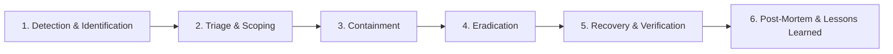

# Security Incident Response Runbook: ReadToImprove

**Date:** 2026-09-27  
**Audience:** Development, Operations, and Security Leads  
**Standard:** NIST SP 800-61 Rev. 2 (Computer Security Incident Handling Guide)  

---

## 1. Incident Severity Classification

| Severity Level | Definition | Response SLA | Escalation Target | Example Scenarios |
| :--- | :--- | :--- | :--- | :--- |
| **P1 — Critical** | Active compromise of administrative credentials, database data exfiltration, or complete platform unavailability. | **Immediate (< 15 min)** | Engineering Lead, Security Officer | Secret leakage in public repo, admin account takeover, unauthenticated DB breach. |
| **P2 — High** | Exploitable vulnerability discovered in production, localized IDOR, or continuous brute-force attack bypassing rate limiters. | **< 1 hour** | Security Engineer | Tenant isolation failure, persistent XSS in public content, high-volume automated credential stuffing. |
| **P3 — Medium** | Moderate security advisory in transitive dependencies, non-exploitable misconfiguration, or low-impact rate limit evasion. | **< 24 hours** | Developer on Call | Dependency CVE with no active exploit path, missing non-critical HTTP header, sporadic crawl spam. |
| **P4 — Low** | Informational security event, minor documentation gap, or non-sensitive log formatting anomaly. | **< 3 business days** | Development Team | Minor typo in security documentation, non-standard user agent spike. |

---

## 2. Incident Response Lifecycle



### Phase 1: Detection & Identification
- **Sources of Detection:**
  - Automated alarms from `AuditLog` table (`UNAUTHORIZED_ADMIN_ACCESS_ATTEMPT` spikes).
  - Rate limiting alerts from Upstash Redis or Vercel metrics.
  - User or external security researcher vulnerability reports.
  - Automated GitHub Dependabot security alerts.

---

### Phase 2: Triage & Scoping
- **Initial Assessment Questions:**
  1. Is the threat actively ongoing, or was it a past probing attempt?
  2. What data or endpoints were accessed (inspect `AuditLog` and database access timestamps)?
  3. Are regular learner profiles affected, or is the threat isolated to the administrative console?
- **Evidence Preservation:**
  - Dump relevant audit logs to an immutable archive:
    ```sql
    COPY (
      SELECT * FROM "AuditLog" 
      WHERE "createdAt" >= NOW() - INTERVAL '48 HOURS'
    ) TO '/tmp/incident_audit_dump.csv' WITH CSV HEADER;
    ```

---

### Phase 3: Containment Protocols

#### Scenario A: Admin Credential Compromise
1. Terminate all active sessions immediately by rotating `AUTH_SECRET` in environment variables.
2. Invalidate the compromised administrator account by toggling `isActive = false`:
   ```sql
   UPDATE "User" SET "isActive" = false WHERE "email" = 'compromised_admin@readtoimprove.com';
   ```
3. Block attacker IP addresses at the edge proxy (Cloudflare / Vercel Firewall).

#### Scenario B: Distributed Brute-Force / DoS Attack
1. Tighten rate limiting parameters in `src/lib/rate-limit.ts` (e.g., lower login attempts to 3 per 30 minutes).
2. Enable Cloudflare / Vercel "Under Attack Mode" to enforce JavaScript challenges on suspicious traffic.

---

### Phase 4: Eradication
1. **Identify Root Cause:** Trace the vulnerable commit, endpoint, or unvalidated query.
2. **Develop Forward Fix:** Create a hotfix branch (`hotfix/security-patch-xxx`).
3. **Verify Immunity:** Write a regression unit test in `src/__tests__/security/` proving the exploit is neutralized.
4. **Deploy Hotfix:** Deploy via CI pipeline with full test suite validation.

---

### Phase 5: Recovery & Verification
1. Re-enable suspended user accounts after enforcing mandatory password reset.
2. Verify integrity of database tables (`Article`, `Vocabulary`, `User`, `ReadingHistory`).
3. Monitor production logs for recurrence of the attack vector for a minimum of 48 hours.

---

### Phase 6: Post-Mortem & Incident Documentation
- Within 72 hours of incident resolution, complete a formal Post-Incident Review (PIR) including:
  - Exact timeline of events (Detection, Response, Resolution).
  - Root cause analysis (RCA) with the 5 Whys methodology.
  - Impact assessment (users affected, downtime duration, data exposure).
  - Preventative action items with assigned owners and target dates.
